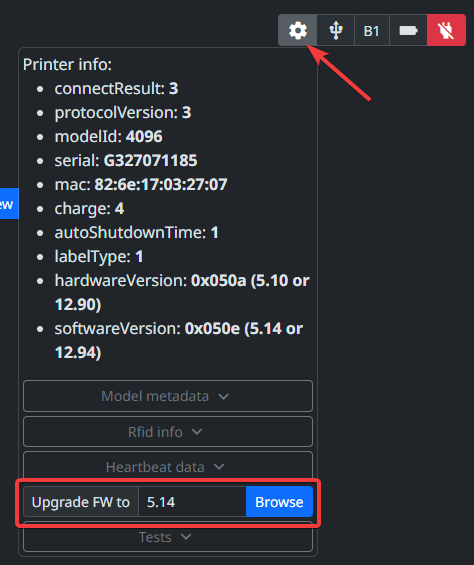
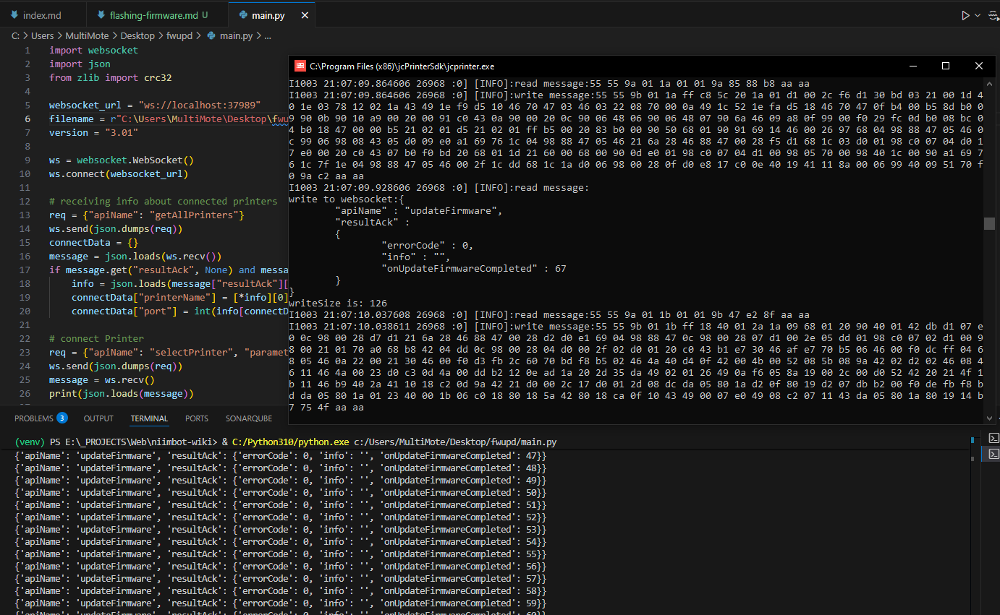

# Flashing firmware

!!! warning

    Use only the firmware for your printer model.
    Do not use different major firmware versions (for example, if you have `5.14`, do not flash `6.x`) or you will brick your printer!

## Easy way - NiimBlue

Open [niim.blue](https://niim.blue), connect your printer and use printer menu to flash the firmware[^1].



## Hard way - jcPrinterSdk

jcPrinterSdk comes with NIIMBOT 3.x for Windows (and for other OS maybe).
jcprinter is a local websocket server that the NIIMBOT application uses to communicate with the printer.
To run server in foreground, other instances must be closed.

To flash firmware with jcprinter, the following Python script[^2] can be used:


```python
import websocket
import json
from zlib import crc32

websocket_url = "ws://localhost:37989"
filename = "/absolute/path/to/firmware.bin"
version = "3.01"

ws = websocket.WebSocket()
ws.connect(websocket_url)

# receiving info about connected printers
req = {"apiName": "getAllPrinters"}
ws.send(json.dumps(req))
connectData = {}
message = json.loads(ws.recv())
if message.get("resultAck", None) and message["resultAck"].get("info", None):
    info = json.loads(message["resultAck"]["info"])
    connectData["printerName"] = [*info][0]
    connectData["port"] = int(info[connectData["printerName"]])

# connect Printer
req = {"apiName": "selectPrinter", "parameter": connectData}
ws.send(json.dumps(req))
message = ws.recv()
print(json.loads(message))

# enable detailed logging to console
req = {"apiName": "enableConsoleAllLog", "parameter": {"isEnable": 1}}
ws.send(json.dumps(req))
while True:
    message = json.loads(ws.recv())
    if message.get("apiName", None) == req["apiName"]:
        break
print(message)

with open(filename, "rb") as f:
    fw = f.read()
    crc = crc32(fw)

print(f"Firmware CRC: {crc:08X}")

req = {
    "apiName": "updateFirmware",
    "parameter": {
        "fileName": filename,
        "strSwVersion": version,
        "strCrc": f"{crc:08X}",
    },
}

ws.send(json.dumps(req))

while True:
    message = json.loads(ws.recv())
    if message.get("apiName", None) == req["apiName"]:
        print(message)
        resAck = message.get("resultAck", None)
        if resAck and resAck.get("result", None) == 0:
            break

# close the websocket connection
ws.close()
```



[^1]: [NiimBlue Wiki: Flashing firmwares](https://github.com/MultiMote/niimblue/wiki/Flashing-firmwares)

[^2]: [B21: Hack to not waste labels during testing, comment by CryoZ](https://github.com/AndBondStyle/niimprint/issues/34#issuecomment-2558283591)