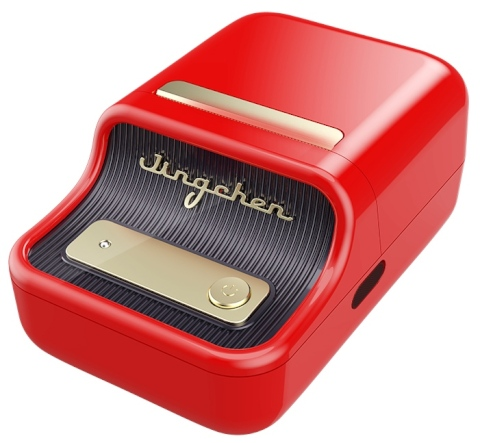
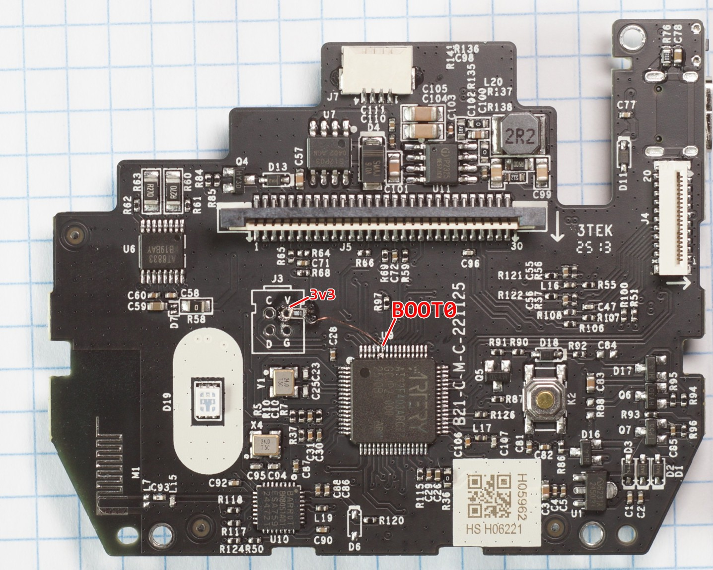

# About NIIMBOT B21_C2B

## Properties

<!-- BEGIN B21_C2B CLOUD_INFO -->
<!-- Auto-generated, do not edit -->
| Parameter                                 | Value        |
|-------------------------------------------|--------------|
| ID                                        | 771, 775     |
| DPI                                       | 203          |
| Printhead size                            | 48mm (384px) |
| Print direction                           | top          |
| [Paper types](../../other/label-types.md) | 1,3,5,2      |
| Density range                             | 1-[3]-5      |
| Printer type                              | thermal      |
<!-- END CLOUD_INFO -->

## HW 40.10

| Parameter                         | Value                                                                       |
| --------------------------------- | --------------------------------------------------------------------------- |
| MCU                               | [Artery AT32F403ARCT7](https://www.arterychip.com/en/product/AT32F403A.jsp) |
| Firmware base address             | 0x8002000                                                                   |
| Unique printer ID segment address | 0x803f000                                                                   |
| Firmware file offset              | 0                                                                           |

