# Unbricking NIIMBOT B21_C2B

!!! warning

    This procedure will result in the irreversible loss of factory data
    (serial number, MAC address, etc.).

    Official firmware updates will no longer be possible.
    Printing via the official app will likely stop working due to an
    invalid serial number.

    There is a risk of permanently bricking the device if it isn't already
    bricked.

    This guide was written for hardware version 40.10. For other versions,
    steps and files may differ.

    Firmware for different hardware versions is not interchangeable.

## About the firmware for this printer

The printer runs on a `Artery AT32F403ARCT7` microcontroller. The
firmware consists of several parts:

1.  `0x00000000` - bootloader
2.  `0x08002000` - main firmware
3.  `0x0803f000` - section with serial number, MAC address, and other per-device data

### Main firmware

The main part is simple. It is updated by the official app over
Bluetooth or USB.
Firmware files are not published openly, but through the API I collected
all available versions [here](https://fw.niim.blue/).

The firmware doesn't load from address zero because there is a
bootloader.
The easiest way I found to determine the base address was by using
Binary Ninja's Triage View.
Tools like basefind/rbasefind/binbloom either froze or produced
nonsense.

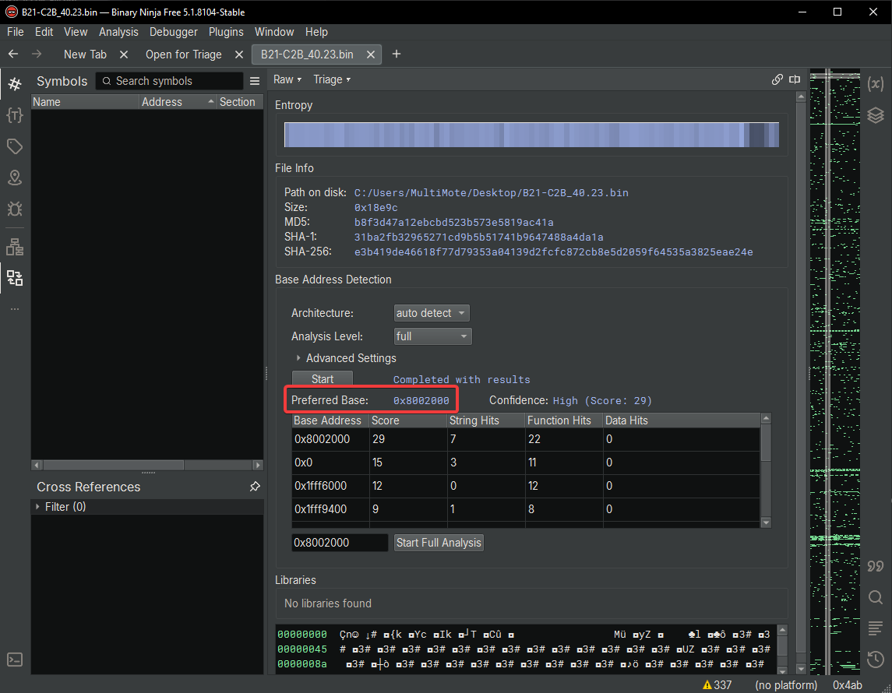

### Bootloader

Here's where problems start. The bootloader for this printer cannot be
found anywhere.

You could try dumping firmware from a working printer to obtain the
bootloader, but the microcontroller is read-protected, and disabling protection will
erase the contents.

That leaves one option - writing your own bootloader.

From the Artery [AT32F403A product page](https://www.arterychip.com/en/product/AT32F403A.jsp) I downloaded
everything needed: Keil packs and project templates.
I won't describe the process of setting up the dev environment, since
that alone would be an article.

The bootloader will be minimal. It just needs to jump to the user
program at `0x08002000`.

The original bootloader also handled firmware updates via USB/Bluetooth,
but implementing that from scratch without knowing the original design
is beyond me.

Here's the code I ended up with:

```c
#include "at32f403a_407.h"

#define APP_ADDRESS  0x08002000

typedef void (*pFunction)(void);

void jump_to_app(void)
{
    uint32_t appStack = *(__IO uint32_t*)APP_ADDRESS;
    pFunction appEntry = (pFunction)*(__IO uint32_t*)(APP_ADDRESS + 4);

    if ((appStack & 0x2FFE0000) == 0x20000000)  // Check for valid RAM address
    {
        __disable_irq();
        SCB->VTOR = APP_ADDRESS;
        __set_MSP(appStack);
        __enable_irq();
        appEntry();
    }
}

int main(void)
{
    jump_to_app();

    while (1)
    {}
}
```

Compiled bootloader: [AT32F403A_bootloader_min.hex](../files/b21_c2b/unbrick/AT32F403A_bootloader_min.hex)

### Section with unique printer data

Structure is unknown.

This section is lost when disabling microcontroller protection.
At best, the printer will think its serial number is all ones.

## Putting the microcontroller into programming mode

Turns out you don't need to buy a programmer to flash this chip.
It's enough to switch it into USB DFU mode, after which the printer will
appear as a USB device for flashing.

To enter USB DFU mode, the BOOT0 pin must be pulled high during
power-on.

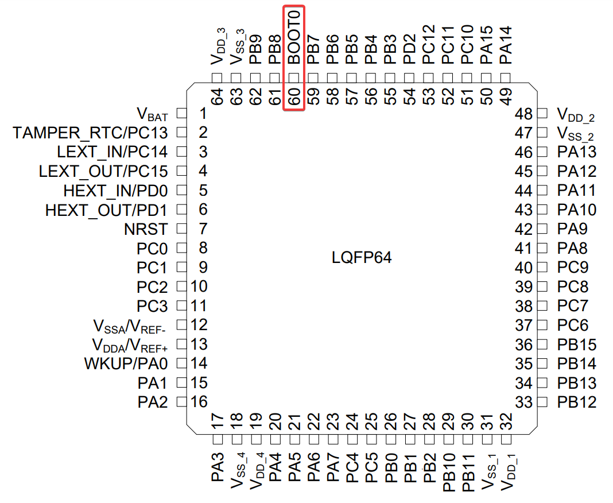

On the board, BOOT0 is pulled low via a 10k resistor. I connected BOOT0
to 3.3V via 1k. Direct connection also works.

With a microscope or good eyesight, you can solder directly to the
microcontroller pin. That's what I did, so I didn't even need to remove
the board.

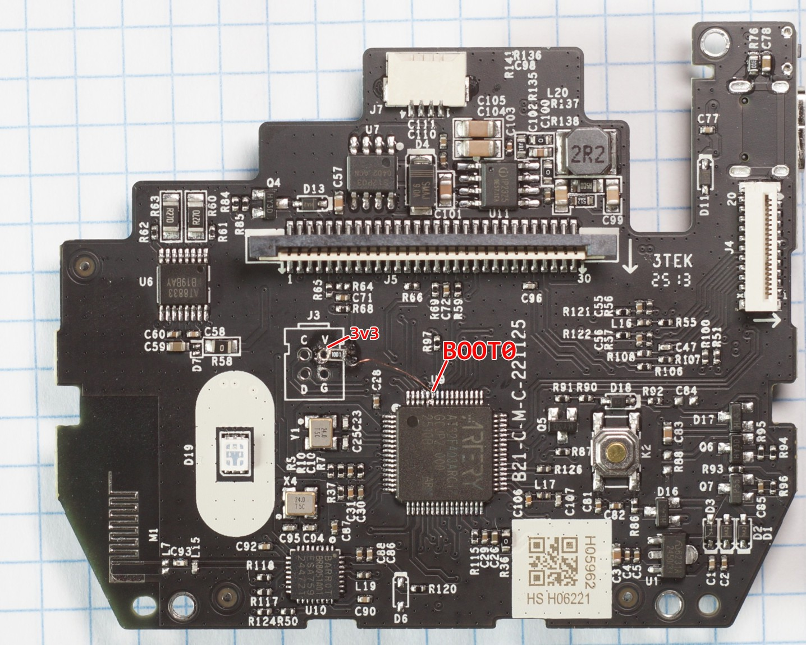

On the other side of the board, there is a testpoint for BOOT0, which
can also be used.

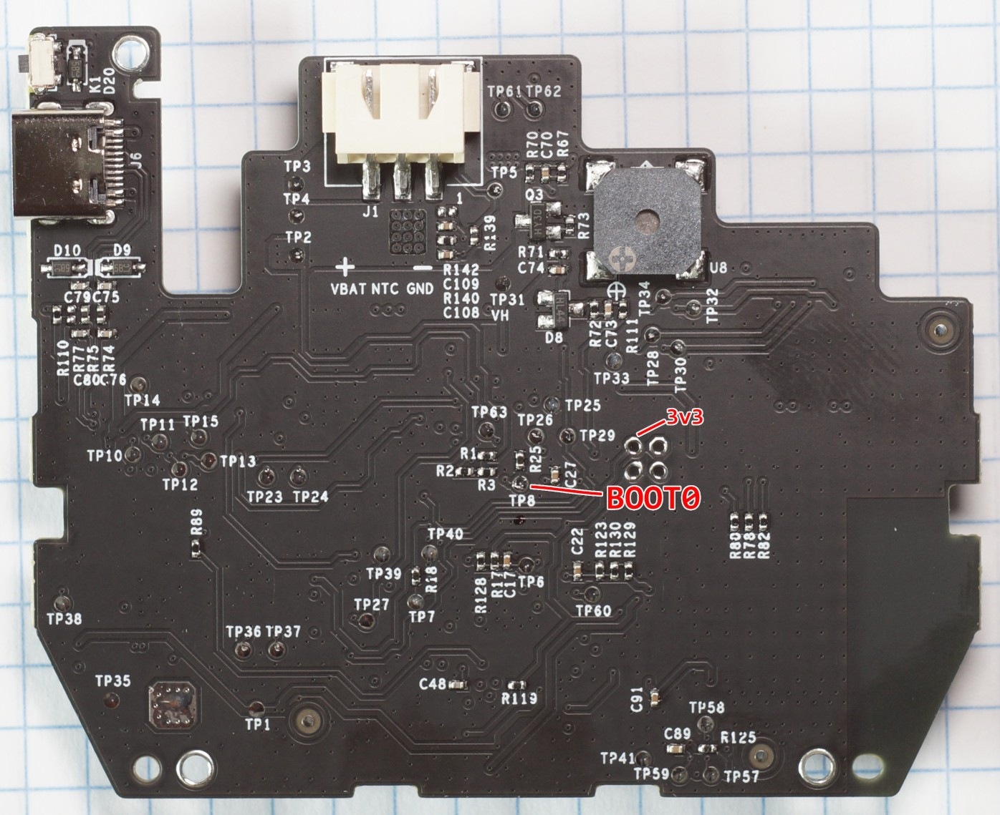

## Removing microcontroller protection

The programmer can be downloaded
[here](https://www.arterychip.com/en/support/index.jsp). It's called
Artery ISP Programmer.
I've also mirrored the archive at the end of this article.

Install the driver and launch the programmer. Select `USB DFU` as the
port type. The microcontroller should appear in the list.

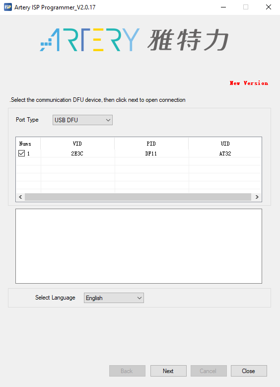

Next, you'll see the memory blocks overview. All blocks are protected.
This protection must be removed.

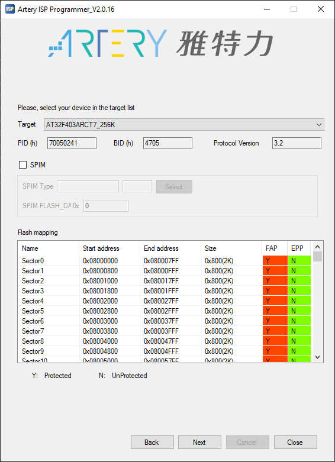

Choose `Protection` mode.

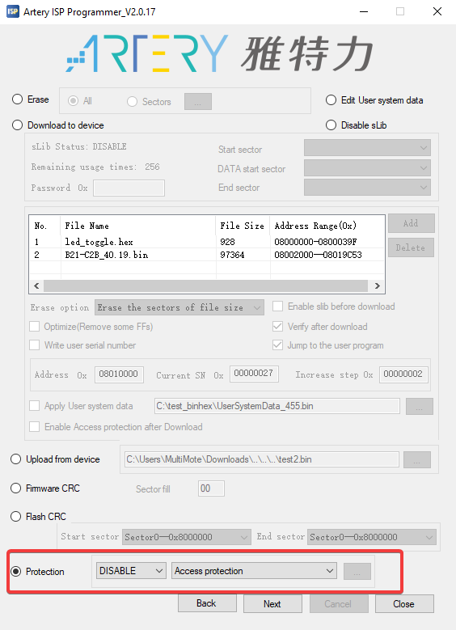

> ⚠️ **POINT OF NO RETURN**
> After confirmation, the printer will become completely non-functional
> if it showed any signs of life before.

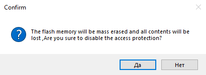

## Uploading the program

Reconnect to the microcontroller. Select `Download to device` mode.

1.  Click `Add` and select the bootloader
    [AT32F403A_bootloader_min.hex](../files/b21_c2b/unbrick/AT32F403A_bootloader_min.hex).
2.  Click `Add` again and select the firmware
    [B21-C2B_40.19.bin](../files/b21_c2b/unbrick/B21-C2B_40.19.bin).

This applies only to hardware version `40.x`. Other versions need their
own firmware ([stable](https://fw.niim.blue/stable/B21-C2B/)
/ [testing](https://fw.niim.blue/testing/B21-C2B/)).
The major firmware version must match the hardware version (e.g.,
hardware `12.01` requires firmware `12.x`).

Set the start address to `08002000`.

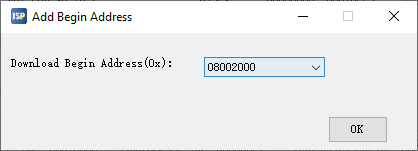

Check the `Jump to user program` option so the printer immediately runs
its program after flashing. Otherwise, you'll need to remove the jumper
and reconnect USB.

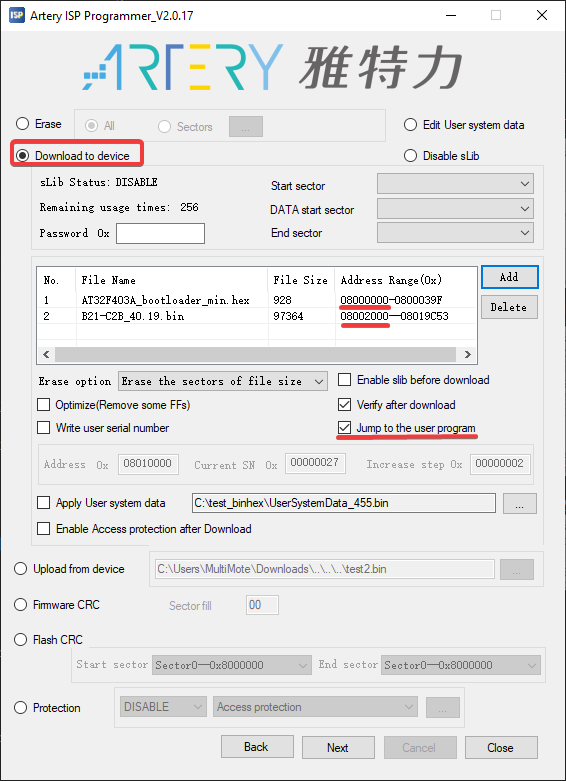

Start the process.

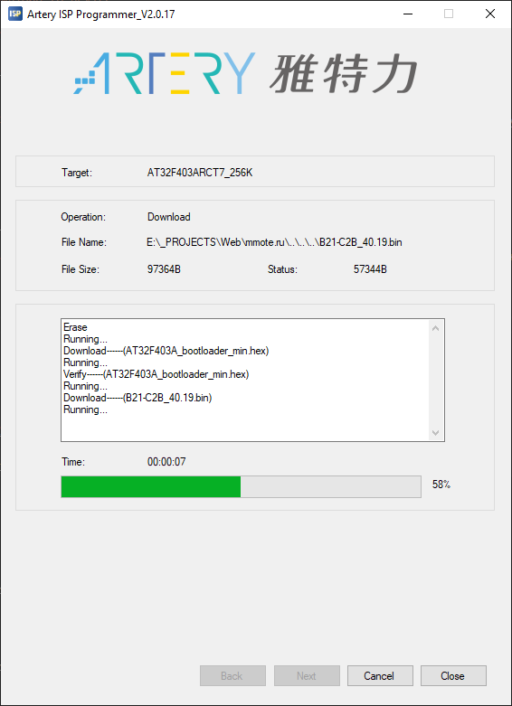

At the end, the printer will be detected by the computer and start
blinking its LED.

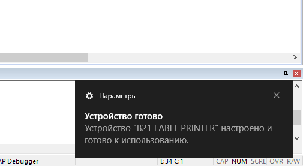

That's basically it. As side effects, further official firmware updates
won't work.
Printing from the official app will also likely fail due to serial
number issues.

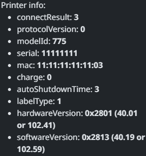

So [NiimBlue](https://niim.blue) is an option.

## Miscellaneous

Copies of files from the Artery site:

- [DS_AT32F403A_V2.04_EN.pdf](../files/b21_c2b/unbrick/DS_AT32F403A_V2.04_EN.pdf) (datasheet)
- [Artery_ISP_Programmer_V2.0.17.zip](../files/b21_c2b/unbrick/Artery_ISP_Programmer_V2.0.17.zip)
  (programmer)
- [Keil5_AT32MCU_AddOn_V2.4.6.zip](../files/b21_c2b/unbrick/Keil5_AT32MCU_AddOn_V2.4.6.zip)
  (Keil packs)
