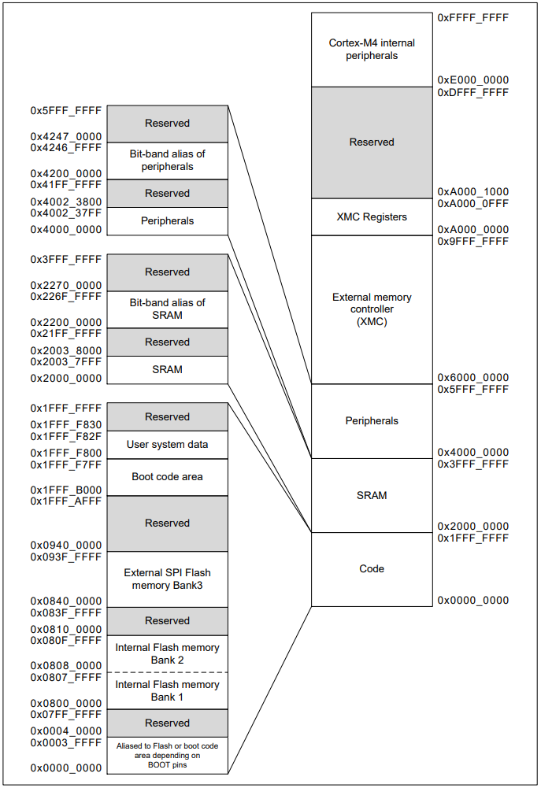

# MCU specifications

## YiCHiP YC3121-L

Memory map:

| Region         | Start Address  |
|----------------|----------------|
|                | 0xFFFFFFFF     |
| Restricted     | 0xE00FF000     |
| PPB            | 0xE0000000     |
| Restricted     | 0x02000000     |
| Flash (512KB)  | 0x01000000     |
| Restricted     | 0x000FA000     |
| Peripherals    | 0x000F0000     |
| Restricted     | 0x00030000     |
| RAM (64KB)     | 0x00020000     |
| Restricted     | 0x00008000     |
| ROM (32KB)     | 0x00000000     |

## Artery AT32F403A

Memory map:

