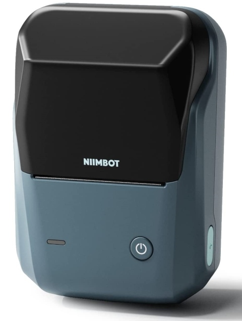
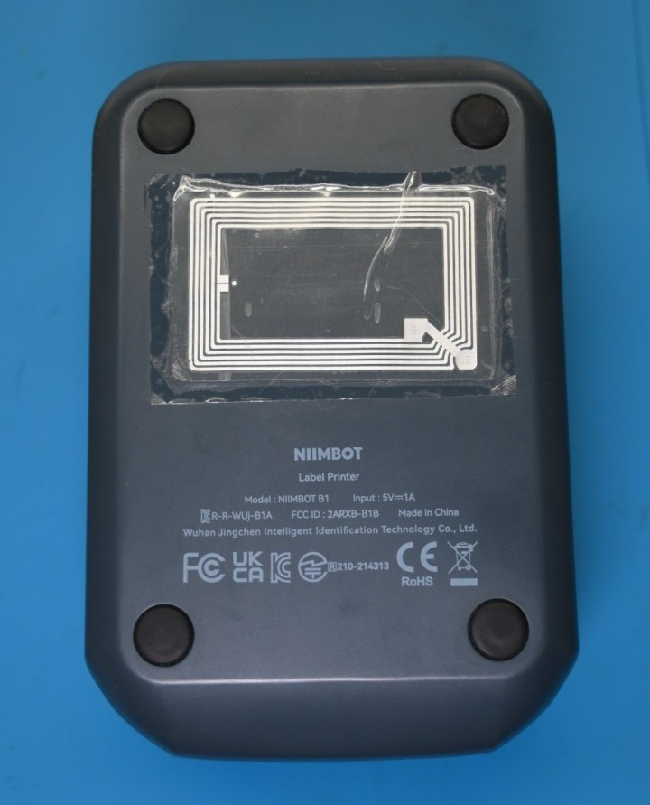

# NIIMBOT B1

# Properties

<!-- BEGIN B1 CLOUD_INFO -->
<!-- Auto-generated, do not edit -->
| Parameter                              | Value        |
|----------------------------------------|--------------|
| ID                                     | 4096         |
| DPI                                    | 203          |
| Printhead size                         | 48mm (384px) |
| Print direction                        | top          |
| [Paper types](../other/label-types.md) | 1,2,5        |
| Density range                          | 1-[3]-5      |
| Printer type                           | thermal      |
<!-- END CLOUD_INFO -->

## HW 5.10

| Parameter             | Value                                         |
|-----------------------|-----------------------------------------------|
| MCU                   | [YiCHiP YC3121-L](http://www.yichip.com/yc3x) |
| Firmware base address | 0x01010000                                    |
| Firmware file offset  | 0                                             |

# Attaching RFID tag to the printer case

You can carefully detach RFID tag from the roll and attach it to the printer case as shown below:

This can be used for testing purposes as it allows to print on any label paper.

Notes:

* Counter will be still incremented.
* First calibration (after power up and lid close) will use RFID paper height so If you are using different paper height, first print may be misaligned.