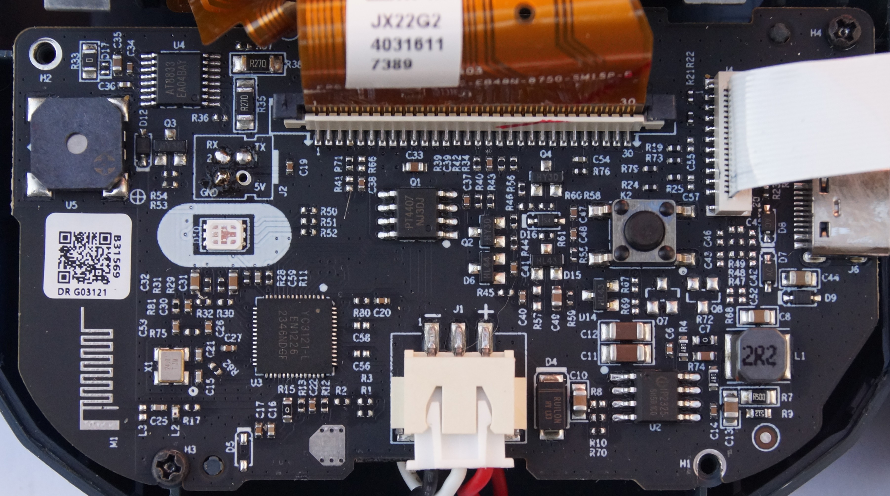

# NIIMBOT B1

# Properties

<!-- BEGIN B1 CLOUD_INFO -->
<!-- Auto-generated, do not edit -->
| Parameter                                | Value        |
|------------------------------------------|--------------|
| ID                                       | 4096         |
| [Paper types](/interfacing/paper-types/) | 1,2,5        |
| DPI                                      | 203          |
| Printhead size                           | 48mm (384px) |
| Print direction                          | top          |
<!-- END CLOUD_INFO -->

## HW 5.10

| Parameter             | Value                                         |
|-----------------------|-----------------------------------------------|
| MCU                   | [YiCHiP YC3121-L](http://www.yichip.com/yc3x) |
| Firmware base address | 0x8001000                                     |
| Firmware file offset  | 0                                             |

