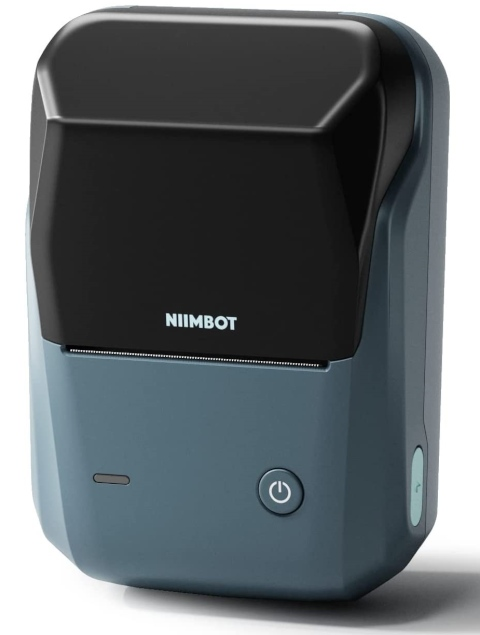

# NIIMBOT B1 Pro

# Properties

<!-- BEGIN B1_PRO CLOUD_INFO -->
<!-- Auto-generated, do not edit -->
| Parameter                              | Value        |
|----------------------------------------|--------------|
| ID                                     | 4097         |
| DPI                                    | **300**      |
| Printhead size                         | 48mm (567px) |
| Print direction                        | top          |
| [Paper types](../other/label-types.md) | 1,2,5        |
| Density range                          | 1-[3]-5      |
| Printer type                           | thermal      |
<!-- END CLOUD_INFO -->

## HW

| Parameter             | Value                            |
|-----------------------|----------------------------------|
| MCU                   | ?                                |
| Firmware base address | ⚠ Firmware seems to be encrypted |
| Firmware file offset  | 0                                |

