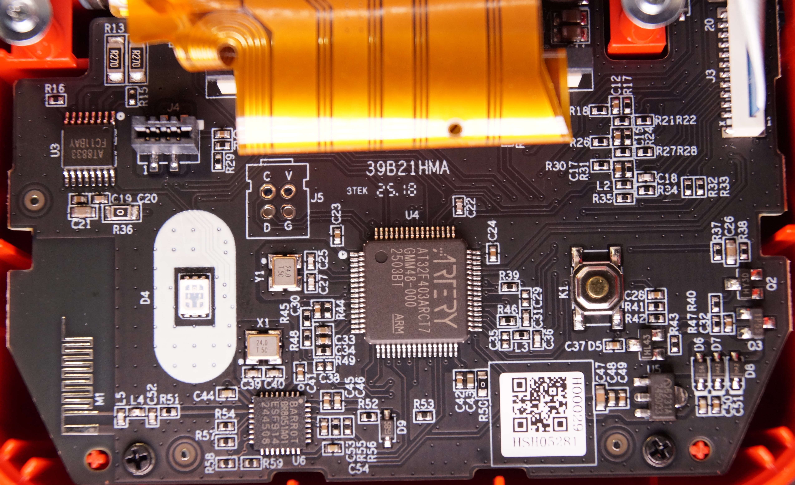

# NIIMBOT B21_PRO

Uses two optical sensors for paper positioning.

## Properties

<!-- BEGIN B21_PRO CLOUD_INFO -->
<!-- Auto-generated, do not edit -->
| Parameter                                    | Value        |
|----------------------------------------------|--------------|
| ID                                           | 785          |
| DPI                                          | **300**      |
| Printhead size                               | 50mm (591px) |
| Print direction                              | top          |
| [Paper types](../interfacing/paper-types.md) | 1,2,3,5      |
| Density range                                | 1-[3]-5      |
| Printer type                                 | thermal      |
<!-- END CLOUD_INFO -->

## HW 3.01

| Parameter             | Value                                                                       |
|-----------------------|-----------------------------------------------------------------------------|
| MCU                   | [Artery AT32F403ARCT7](https://www.arterychip.com/en/product/AT32F403A.jsp) |
| Firmware base address | 0x8002000                                                                   |
| Firmware file offset  | 0x1C                                                                        |

