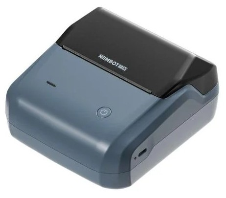
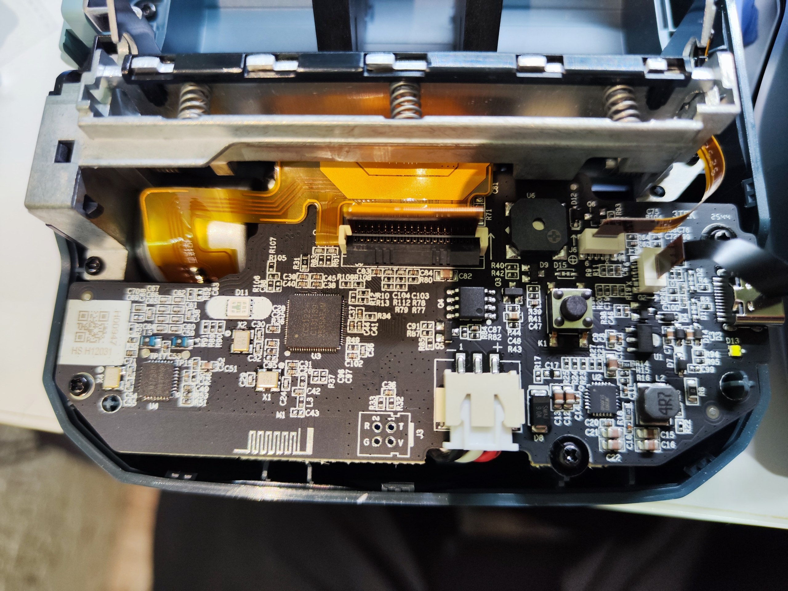
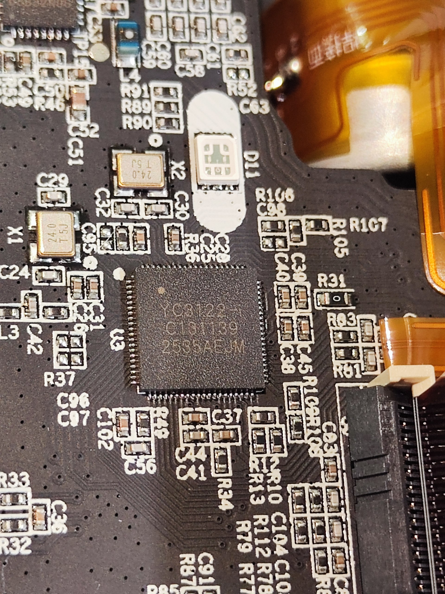

# NIIMBOT B31

# Properties

<!-- BEGIN B31 CLOUD_INFO -->
<!-- Auto-generated, do not edit -->
| Parameter                              | Value        |
|----------------------------------------|--------------|
| ID                                     | 5632         |
| DPI                                    | 203          |
| Printhead size                         | 75mm (600px) |
| Print direction                        | top          |
| [Paper types](../other/label-types.md) | 1,2,5        |
| Density range                          | 1-[3]-5      |
| Printer type                           | thermal      |
<!-- END CLOUD_INFO -->

## HW 5.10

| Parameter             | Value                                         |
|-----------------------|-----------------------------------------------|
| MCU                   | [YiCHiP YC3122-L](http://www.yichip.com/yc3x) |
| Firmware base address | 0x01010000                                    |
| Firmware file offset  | 0x1C                                          |

Photo taken by @tumbo4k_a
