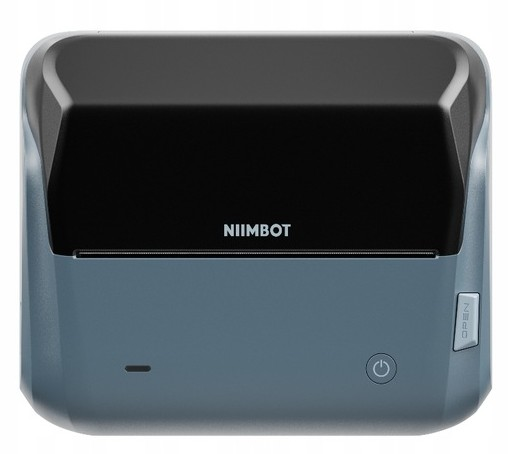

# NIIMBOT B4

# Properties

<!-- BEGIN B4 CLOUD_INFO -->
<!-- Auto-generated, do not edit -->
| Parameter                              | Value         |
|----------------------------------------|---------------|
| ID                                     | 6656          |
| DPI                                    | 203           |
| Printhead size                         | 104mm (832px) |
| Print direction                        | top           |
| [Paper types](../other/label-types.md) | 1,2,5         |
| Density range                          | 1-[3]-5       |
| Printer type                           | thermal       |
<!-- END CLOUD_INFO -->

## HW

| Parameter             | Value                                                                |
| --------------------- | -------------------------------------------------------------------- |
| MCU                   | [Artery AT32F490RCT7](https://arterytek.com/en/product/AT32F490.jsp) |
| Firmware base address | 0x8002000 ?                                                          |
| Firmware file offset  | 0x1C                                                                 |

Internal Photos: https://fcc.report/FCC-ID/2ARXB-B4A/7870063

