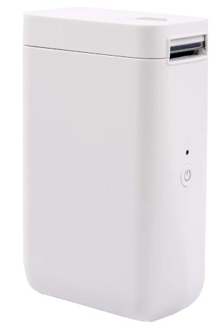

# NIIMBOT D101

## Properties

<!-- BEGIN D101 CLOUD_INFO -->
<!-- Auto-generated, do not edit -->
| Parameter                              | Value        |
|----------------------------------------|--------------|
| ID                                     | 2560         |
| DPI                                    | 203          |
| Printhead size                         | 24mm (192px) |
| Print direction                        | left         |
| [Paper types](../other/label-types.md) | 1,5          |
| Density range                          | 1-[2]-3      |
| Printer type                           | thermal      |
<!-- END CLOUD_INFO -->

# HW 4.01

| Parameter             | Value                                         |
| --------------------- | --------------------------------------------- |
| MCU                   | [YiCHiP YC3121](http://www.yichip.com/yc3x) |
| Firmware base address | 0x01010000                                    |
| Firmware file offset  | 0                                             |
