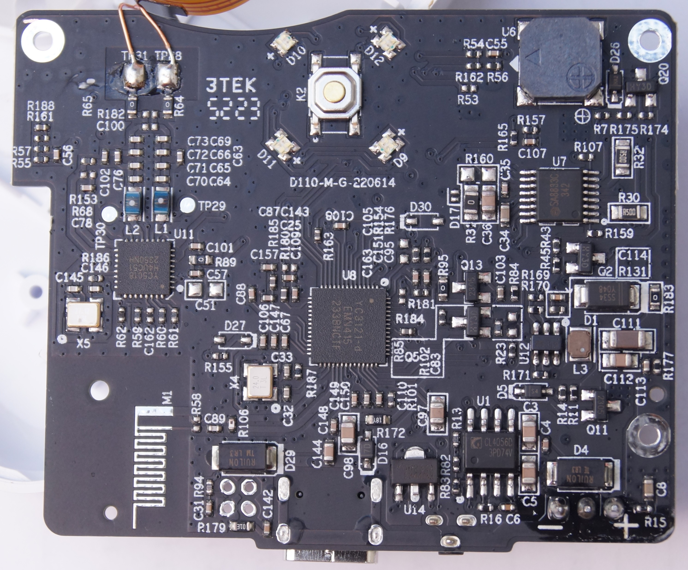

# NIIMBOT D110

## Properties

<!-- BEGIN D110 CLOUD_INFO -->
<!-- Auto-generated, do not edit -->
| Parameter             | Value       |
|-----------------------|-------------|
| ID                    | 2304, 2305  |
| Supported paper types | 1,5         |
| DPI                   | 203         |
| Printhead size        | 12mm (96px) |
| Print direction       | left        |
<!-- END CLOUD_INFO -->

# HW

| Parameter             | Value                                         |
| --------------------- | --------------------------------------------- |
| MCU                   | [YiCHiP YC3121-d](http://www.yichip.com/yc3x) |
| Firmware base address | 0x8001000                                     |
| Firmware file shift   | 0                                             |

