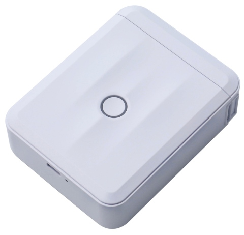
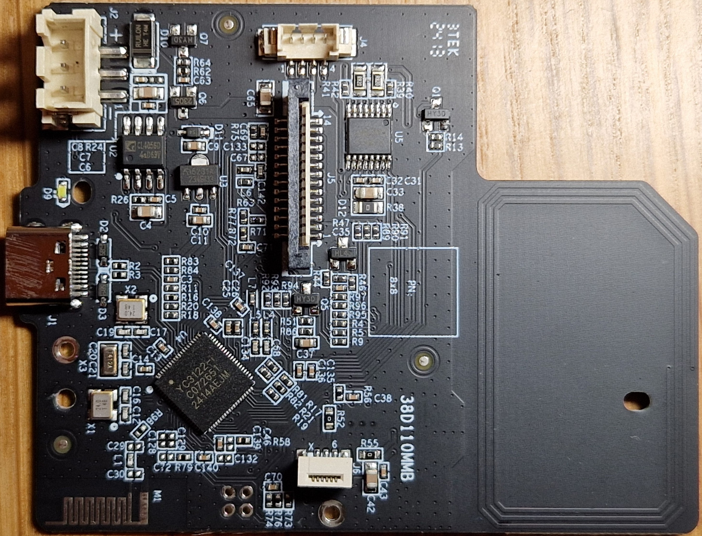

# NIIMBOT D110_M

## Properties

<!-- BEGIN D110_M CLOUD_INFO -->
<!-- Auto-generated, do not edit -->
| Parameter                              | Value       |
|----------------------------------------|-------------|
| ID                                     | 2320        |
| DPI                                    | 203         |
| Printhead size                         | 12mm (96px) |
| Print direction                        | left        |
| [Paper types](../other/label-types.md) | 1,5         |
| Density range                          | 1-[3]-5     |
| Printer type                           | thermal     |
<!-- END CLOUD_INFO -->

## HW

| Parameter             | Value                                         |
| --------------------- | --------------------------------------------- |
| MCU                   | [YiCHiP YC3122-L](http://www.yichip.com/yc3x) |
| Firmware base address | 0x01010000                                    |
| Firmware file offset  | 0x1C                                          |

Photo taken by Zsolt.

## Downgrading firmware

D110_M is known for refusing to accept firmware versions lower than the current one.
See [flashing firmware](../firmware/flashing-firmware.md#downgrading-firmware).
