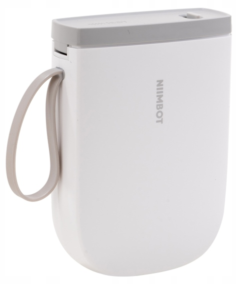

# NIIMBOT D11_H

# Properties

<!-- BEGIN D11_H CLOUD_INFO -->
<!-- Auto-generated, do not edit -->
| Parameter                                | Value        |
|------------------------------------------|--------------|
| ID                                       | 528          |
| [Paper types](/interfacing/paper-types/) | 1,5          |
| DPI                                      | **300**      |
| Printhead size                           | 12mm (142px) |
| Print direction                          | left         |
<!-- END CLOUD_INFO -->

## HW

| Parameter             | Value                                         |
| --------------------- | --------------------------------------------- |
| MCU                   | [YiCHiP YC3122-L](http://www.yichip.com/yc3x) |
| Firmware base address | 0x8001000                                     |
| Firmware file offset  | 0x1C                                          |

