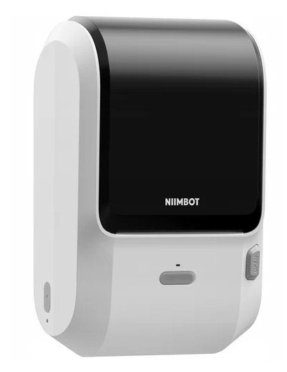
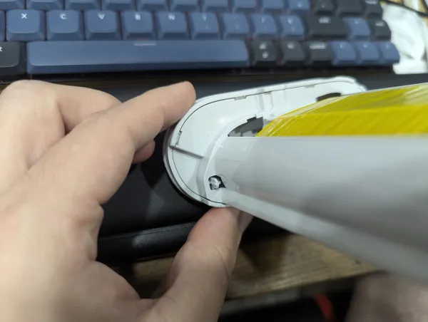
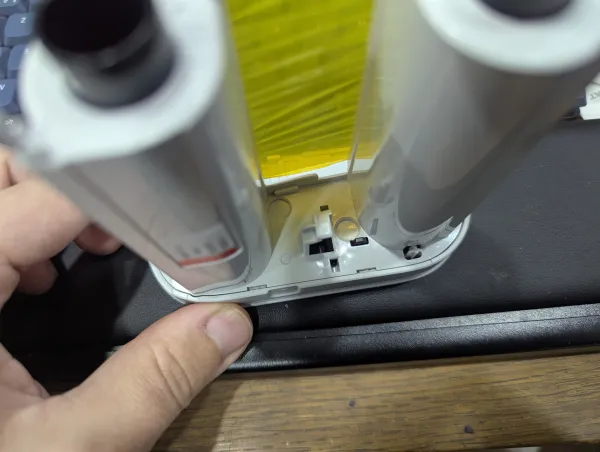
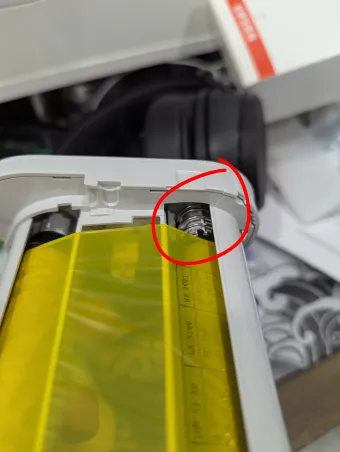
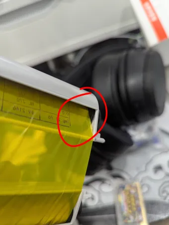
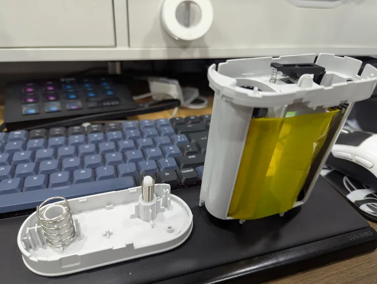
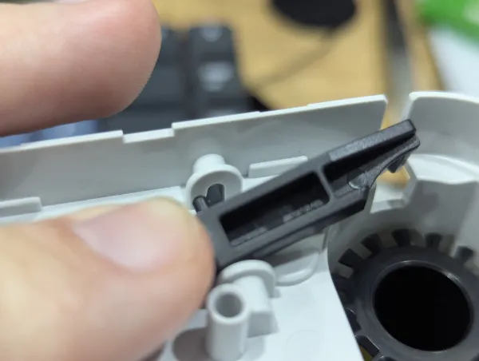
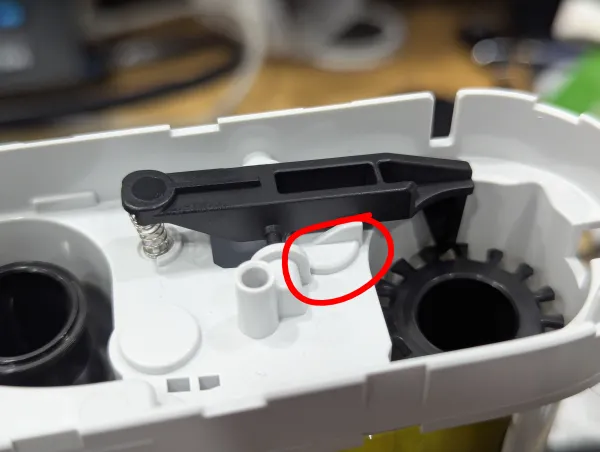
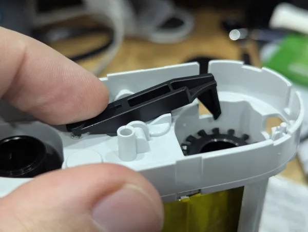
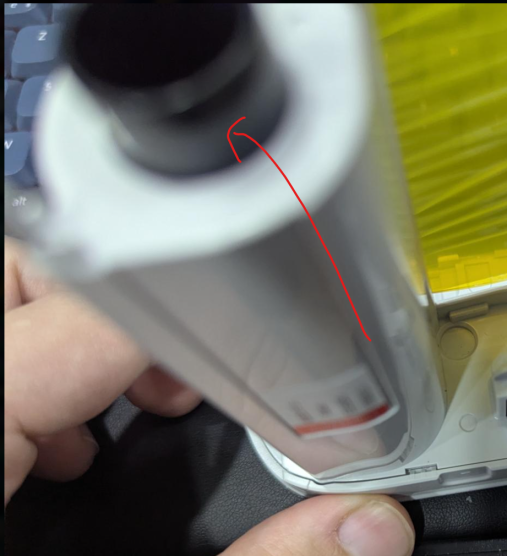

# NIIMBOT M3

# Properties

<!-- BEGIN M3 CLOUD_INFO -->
<!-- Auto-generated, do not edit -->
| Parameter                              | Value            |
|----------------------------------------|------------------|
| ID                                     | 6400             |
| DPI                                    | **300**          |
| Printhead size                         | 72mm (851px)     |
| Print direction                        | top              |
| [Paper types](../other/label-types.md) | 1,5,2,10         |
| Density range                          | 1-[3]-5          |
| Printer type                           | thermal transfer |
<!-- END CLOUD_INFO -->

## HW

| Parameter             | Value  |
| --------------------- | ------ |
| MCU                   | ? |
| Firmware base address | 0x8002000 |
| Firmware file offset  | 0x1C |

## Refilling ribbon cartridge

!!! note

    This was copied from NiimBlue's Discord with the permission of 666dsa666.

There are 6 tabs on the "inside" part of the ribbon, you need to pry them open, don't do 4 and hope the two left will follow, they won't. 

 

Be careful, there are springs and washers inside, don't want to lose them
Two washers, three springs.

 

Washers may be stuck on the plastic and may not fall, that's ok.

Hold the ribbon like this before opening, will prevent any issues with the ribbon itself but will make losing two springs easier so be really careful, thirs one is visible on the top of the right part.

You will need to get the black lever out, to do this, push on the spring and push down.

  

Then you're pretty much done, only thing keeping the two rolls from getting out is the ribbon itself, either cut it or roll the right roll until you see the glue holding the ribbon to the roll on the left roll and carefully remove it (you don't have to be that careful though, just try to not leave too much residue).

Get the two rolls out, the empty one is where you need to reroll your new ribbon, 30m is the niimbot "full" roll, you may be able to get probably 40/50m without much issue other than time.

I used tape to hold the end of the ribbon to the roll, worked well, key is centering, especially with 70mm width (M3 is 68mm, 70 fits but is creased on the sides, doesn't cause issue though).

Get both roll in, the right one (with the gear) being still empty, catch the end of the ribbon and tape it to the empty roll, put everything back together.

Final step is tensioning.

Hold the full roll, turn the empty one a few clicks using the outside part while holding the full one without too much force until it looks barely tensioned, not drooping yet not under full tension, it will self tension once you get it inside and turn the printer on.

Please measure the original ribbon width, M3 is 68mm, getting 65mm will work but you will loose 1.5mm on each side of the full printing width so you still have a lot to work with, getting 70mm works but is 1% harder to work with as centering becomes more important.
