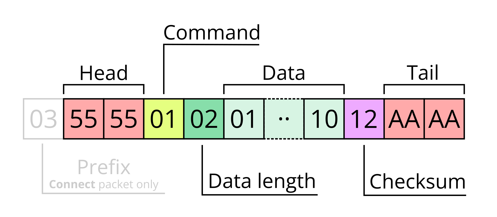
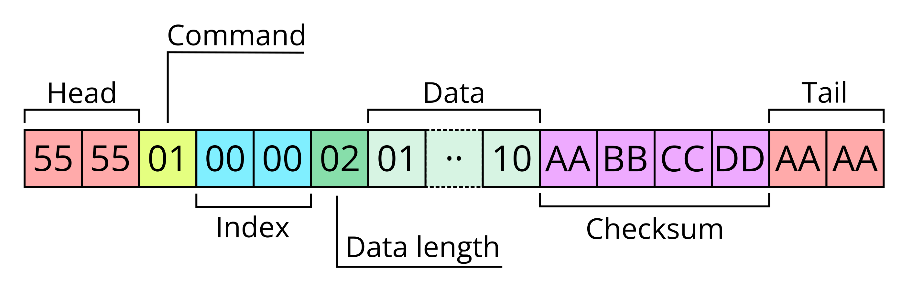
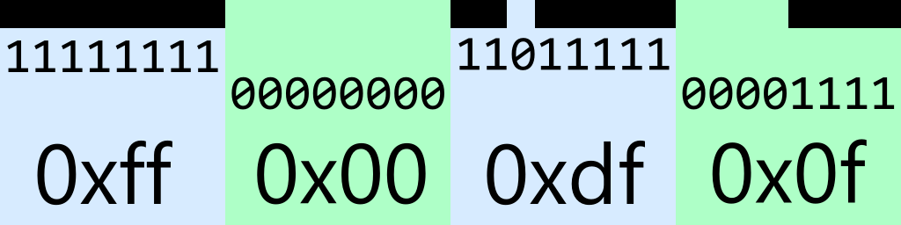

# Printers protocol

## Packet structure

### Main packet



* **Prefix** - prefix `0x03` is present in only one command - **Connect**.
* **Head** - always 2 bytes (`0x55` `0x55`).
* **Command** - command (packet) identifier.
* **Data Length** - number of bytes of data.
* **Data** - data with **Data length** length.
* **Checksum** - calculated by XOR of all bytes from **Command** to the last byte of **Data** (inclusive).
* **Tail** - always 2 bytes (`0xAA` `0xAA`).

### CRC32 (firmware) packet



* **Head** - always 2 bytes (`0x55` `0x55`).
* **Command** - command (packet) identifier.
* **Index** - firmware chunk index, used only in `FirmwareChunk` and `In_RequestFirmwareChunk` packets, otherwise equals zero.
* **Data Length** - number of bytes of data.
* **Data** - data with **Data length** length.
* **Checksum** - crc32 checksum of all bytes from **Command** to the last byte of **Data** (inclusive).
* **Tail** - always 2 bytes (`0xAA` `0xAA`).

## List of packet commands

### Client → Printer (Request IDs)

| Request ID | Name                                                                              |         Response ID(s)         | Simple OUT | Simple IN |
| :--------: | --------------------------------------------------------------------------------- | :----------------------------: | :--------: | :-------: |
|   `0x01`   | [PrintStart](#printstart)                                                         |             `0x02`             |     ❌     |    ✅     |
|   `0x03`   | PageStart                                                                         |             `0x04`             |     ✅     |    ✅     |
|   `0x05`   | PrinterLog                                                                        |             `0x06`             |     ✅     |    ❌     |
|   `0x07`   | [PrinterConfig2](#printerconfig2)                                                 |             `0x08`             |     ❌     |    ❌     |
|   `0x09`   | GetKeyFunction                                                                    |             `0x0a`             |     ✅     |    ❌     |
|   `0x0b`   | AntiFake                                                                          |             `0x0c`             |     ❌     |    ❌     |
|   `0x0d`   | GetPrintQuality                                                                   |             `0x0d`             |     ❌     |    ❌     |
|   `0x0e`   | [TubeSettings](#tubesettings)                                                     |             `0x0e`             |     ❌     |    ❌     |
|   `0x0f`   | [TubeTypeAndWidth](#tubetypeandwidth)                                             |             `0x0f`             |     ❌     |    ❌     |
|   `0x10`   | SetOutNet                                                                         |             `0x10`             |     ❌     |    ❌     |
|   `0x11`   | [SetLocalTemplate / SetCurrentTimeFormat](#setlocaltemplate-setcurrenttimeformat) |         `0x11`, `0x12`         |     ❌     |    ❌     |
|   `0x12`   | GetCurrentTimeFormat                                                              |             `0x11`             |     ✅     |    ❌     |
|   `0x13`   | [SetPageSize](#setpagesize)                                                       |             `0x14`             |     ❌     |    ✅     |
|   `0x14`   | PageHeight                                                                        |             `0x14`             |     ❌     |    ❌     |
|   `0x15`   | [PrintQuantity](#printquantity)                                                   |             `0x16`             |     ❌     |    ✅     |
|   `0x17`   | [TemplateHistory](#templatehistory)                                               |         `0x17`, `0x63`         |     ❌     |    ❌     |
|   `0x19`   | [PrinterUsage](#printerusage)                                                     |             `0x19`             |     ❌     |    ❌     |
|   `0x1a`   | [RfidInfo](#rfidinfo-rfidinfo2)                                                   |             `0x1b`             |     ✅     |    ❌     |
|   `0x1c`   | [RfidInfo2](#rfidinfo-rfidinfo2)                                                  |             `0x1d`             |     ✅     |    ❌     |
|   `0x1e`   | [SetReversePrinterFeed](#setreverseprinterfeed)                                   |             `0x1f`             |     ❌     |    ❌     |
|   `0x1f`   | MarginTopHeight                                                                   |             `0x1f`             |     ❌     |    ❌     |
|   `0x20`   | PrintClear                                                                        |             `0x30`             |     ✅     |    ✅     |
|   `0x21`   | [SetDensity](#setdensity)                                                         |             `0x31`             |     ❌     |    ✅     |
|   `0x22`   | [SetPrintSpeed](#setprintspeed)                                                   |             `0x32`             |     ❌     |    ❌     |
|   `0x23`   | [SetLabelType](#setlabeltype)                                                     |             `0x33`             |     ❌     |    ✅     |
|   `0x26`   | [SetLanguageType](#setlanguagetype)                                               |             `0x36`             |     ❌     |    ❌     |
|   `0x27`   | [SetAutoShutdownTime](#setautoshutdowntime)                                       |             `0x37`             |     ❌     |    ✅     |
|   `0x28`   | PrinterReset                                                                      |             `0x38`             |     ✅     |    ❌     |
|   `0x2c`   | [SetPrintMode](#setprintmode)                                                     |             `0x3c`             |     ❌     |    ❌     |
|   `0x2d`   | [SetLabelMaterial](#setlabelmaterial)                                             |             `0x3d`             |     ❌     |    ❌     |
|   `0x2e`   | [SetVolumeLevel](#setvolumelevel)                                                 |             `0x3e`             |     ❌     |    ❌     |
|   `0x2f`   | [SetAntiSetter](#setantisetter)                                                   |             `0x3f`             |     ❌     |    ❌     |
|   `0x40`   | [PrinterInfo](#printerinfo)                                                       |         `0x41`–`0x4f`          |     ✅     |    ❌     |
|   `0x52`   | [PrintingHistory](#printinghistory)                                               |         `0x62`–`0x63`          |     ❌     |    ❌     |
|   `0x54`   | RfidSuccessTimes                                                                  |             `0x64`             |     ✅     |    ❌     |
|   `0x58`   | [SoundSettings](#soundsettings)                                                   |             `0x68`             |     ❌     |    ❌     |
|   `0x59`   | [GetPaperInfo](#getpaperinfo)                                                     |             `0x69`             |     ❌     |    ❓     |
|   `0x5a`   | [PrintTestPage](#printtestpage)                                                   |             `0x6a`             |     ✅     |    ✅     |
|   `0x5c`   | [HalfCut](#halfcut)                                                               |             `0x6c`             |     ❌     |    ❌     |
|   `0x70`   | GetVolumeLevel / WriteRFID                                                        |             `0x71`             |     ❓     |    ❓     |
|   `0x83`   | [PrintBitmapRowIndexed](#printbitmaprowindexed)                                   |          ❌ (one-way)          |     ❌     |     —     |
|   `0x84`   | [PrintEmptyRow](#printemptyrow)                                                   |          ❌ (one-way)          |     ❌     |     —     |
|   `0x85`   | [PrintBitmapRow](#printbitmaprow)                                                 |          ❌ (one-way)          |     ❌     |     —     |
|   `0x8a`   | [PrintBitmapRowDoubleColor](#printbitmaprowdoublecolor)                           |          ❌ (one-way)          |     ❌     |     —     |
|   `0x86`   | [PrinterCheckLine](#printercheckline)                                             |             `0xd3`             |     ❌     |    ❌     |
|   `0x87`   | [CompressCommand](#compresscommand)                                               |          ❌ (one-way)          |     ❌     |     —     |
|   `0x8e`   | [LabelPositioningCalibration](#labelpositioningcalibration)                       |             `0x8f`             |     ✅     |    ✅     |
|   `0xa1`   | [SetPrinterConfigurationWifi](#setprinterconfigurationwifi)                       |             `0xb1`             |     ❌     |    ❌     |
|   `0xa6`   | [Pause](#pause)                                                                   |             `0xb6`             |     ❌     |    ❌     |
|   `0xa2`   | [GetPrinterConfigurationWifi](#getprinterconfigurationwifi)                       |             `0xb2`             |     ✅     |    ❌     |
|   `0xa3`   | [PrintStatus](#printstatus)                                                       |             `0xb3`             |     ✅     |    ❌     |
|   `0xa5`   | [PrinterStatusData](#printerstatusdata)                                           |             `0xb5`             |     ✅     |    ❌     |
|   `0xa7`   | [CompressImage](#compressimage)                                                   |          ❌ (one-way)          |     ❌     |     —     |
|   `0xaf`   | PrinterConfig                                                                     |             `0xbf`             |     ❌     |    ❌     |
|   `0xc1`   | [Connect](#connect)                                                               |             `0xc2`             |     ✅     |    ❌     |
|   `0xc3`   | [PrinterFree](#printerfree)                                                       |             `0xc4`             |     ❌     |    ❌     |
|   `0xda`   | CancelPrint                                                                       |             `0xd0`             |     ✅     |    ✅     |
|   `0xdc`   | [Heartbeat](#heartbeat)                                                           | `0xde`, `0xdf`, `0xdd`, `0xd9` |     ❌     |    ❌     |
|   `0xe3`   | PageEnd                                                                           |             `0xe4`             |     ✅     |    ✅     |
|   `0xf3`   | [PrintEnd](#printend)                                                             |             `0xf4`             |     ✅     |    ✅     |
|   `0xf5`   | [StartFirmwareUpgrade](#startfirmwareupgrade)                                     |             `0xf6`             |     ❌     |    ✅     |


### CRC32 firmware packets (Client → Printer, one-way)

| Request ID | Name                 | Notes                                                           |
| :--------: | -------------------- | --------------------------------------------------------------- |
|   `0x91`   | FirmwareCrc          | Carries CRC32 of entire firmware blob (4-byte payload, index=0) |
|   `0x92`   | FirmwareCommit       | Signals printer to apply the firmware (payload=`01`, index=0)   |
|   `0x9b`   | FirmwareChunk        | One 200-byte chunk; index = chunk number                        |
|   `0x9c`   | FirmwareNoMoreChunks | Signals end of chunk stream (payload=`01`, index=0)             |

### Printer → Client only

| Response ID | Name                              | Notes                                                   |
| :---------: | --------------------------------- | ------------------------------------------------------- |
|   `0xe0`    | In_PrinterPageIndex               |                                                         |
|   `0xd3`    | In_PrinterCheckLine               |                                                         |
|   `0xdb`    | In_PrintError                     |                                                         |
|   `0x90`    | In_RequestFirmwareCrc *(CRC32)*   | Requests client to send firmware checksum               |
|   `0x9a`    | In_RequestFirmwareChunk *(CRC32)* | Requests specific chunk; index = requested chunk number |
|   `0x9d`    | In_FirmwareCheckResult *(CRC32)*  | CRC verification result; data `01` = success            |
|   `0x9e`    | In_FirmwareResult *(CRC32)*       | Final flashing result; data `01` = success              |

## Packet details

Two-byte values are usually u16 (big-endian).

### Simple request packet

This packet has `Request ID`, `Data length = 1`, and `Data = 1`.

Checksum will be same as `Request ID` because `N^1^1 == N`.

Example (RfidInfo):

```
55 55 1a 01 01 1a aa aa
       │  │  │  │
       │  │  │  └─ Checksum (0x1a ^ 0x01 ^ 0x01 = 0x1a)
       │  │  └─ Data = 1
       │  └─ Data length = 1
       └─ RfidInfo command
```

### Simple response packet

Same structure as simple request. Data = `01` on success, `00` on failure.

Example (`In_SetDensity`, `0x31`):

```
55 55 31 01 01 31 aa aa
       │  │  │  │
       │  │  │  └─ Checksum (0x31 ^ 0x01 ^ 0x01 = 0x31)
       │  │  └─ Data (1 = success, 0 = error)
       │  └─ Data length = 1
       └─ In_SetDensity command
```


### Connect

The **only** packet that is prefixed with `0x03` before the standard header.

```
03 55 55 c1 01 01 c1 aa aa
│         │  │  │  │
│         │  │  │  └─ Checksum
│         │  │  └─ Data = 1
│         │  └─ Data length = 1
│         └─ Connect command
└─ Prefix byte (only for Connect)
```

#### Response (`0xc2`)

Data length = 1. The single byte is a `ConnectResult` code:

| Value  | Name           | Meaning                                                                      |
| :----: | -------------- | ---------------------------------------------------------------------------- |
| `0x00` | Disconnect     | Not connected                                                                |
| `0x01` | Connected      | Connected (protocol version 0)                                               |
| `0x02` | ConnectedNew   | Connected (protocol version 1)                                               |
| `0x03` | ConnectedV3    | Connected (protocol version ≥ 3; version determined via `PrinterStatusData`) |
| `0x5a` | FirmwareErrors | Firmware error state                                                         |

**Protocol version negotiation:**

1. Send `Connect` → receive `In_Connect`.
2. If result = `ConnectedNew` → `protocolVersion = 1`.
3. If result = `ConnectedV3` → send `PrinterStatusData` → parse `protocolVersion` from bytes `[11]` and `[12]` of response:
    - `n = data[11]*100 + data[12]`
    - `protocolVersion=3` if `204 ≤ n < 300`,
    - `protocolVersion=4` if `300 ≤ n < 302`,
    - `protocolVersion=5` if `n ≥ 302`.
    - Otherwise `protocolVersion = 0`.

### PrinterStatusData

Request: simple.

#### Response (`0xb5`)

```
55 55 b5 LL XX XX SC SC PS PS PL PL PI XX CS VH VL DC DC XX AA AA
                   └──┤  └──┤  └──┤  │     │  └──┤  └──┤
                      │     │     │  │     │     │     └─ Double Color Max Cache Size
                      │     │     │  │     │     └─────── Protocol Version
                      │     │     │  │     └───────────── Supports color
                      │     │     │  └─────────────────── Packet Interval
                      │     │     └────────────────────── Max Send Size
                      │     └──────────────────────────── Single Packet Size
                      └────────────────────────────────── Single Color Max Cache Size
```

Packet length may vary depending on the printer model.

### PrinterInfo

Request: data = 1 byte.

| Type value | Name               | Response ID | Response data, notes                                               |
| :--------: | ------------------ | :---------: | ------------------------------------------------------------------ |
|   `0x01`   | Density            |   `0x41`    | 1 byte                                                             |
|   `0x02`   | Speed              |   `0x42`    | 1 byte                                                             |
|   `0x03`   | LabelType          |   `0x43`    | 1 byte                                                             |
|   `0x04`   | PrinterHeadWidth   |   `0x44`    | 2 bytes; doesn't seem to be used in firmware                       |
|   `0x05`   | PrintingAccuracy   |   `0x45`    | 1 byte; doesn't seem to be used in firmware                        |
|   `0x06`   | Language           |   `0x46`    | 1 byte                                                             |
|   `0x07`   | AutoShutdownTime   |   `0x47`    | 1 byte                                                             |
|   `0x08`   | PrinterModelId     |   `0x48`    | 1–2 bytes model ID (if 1 byte, value is [VV 00])                   |
|   `0x09`   | SoftWareVersion    |   `0x49`    | 2 bytes; format varies by model                                    |
|   `0x0a`   | BatteryChargeLevel |   `0x4a`    | 1 byte (0–4)                                                       |
|   `0x0b`   | SerialNumber       |   `0x4b`    | Variable: ASCII string if ≥8 bytes, hex of first 4 bytes otherwise |
|   `0x0c`   | HardWareVersion    |   `0x4c`    | 2 bytes; format varies by model                                    |
|   `0x0d`   | BluetoothAddress   |   `0x4d`    | 6 bytes reversed (varies by model)                                 |
|   `0x0e`   | PrintMode          |   `0x4e`    | 1 byte                                                             |
|   `0x0f`   | Area               |   `0x4f`    | unknown                                                            |

Example (get serial number):

```
55 55 40 01 0b XX aa aa
       │  │  │  │
       │  │  │  └─ Checksum
       │  │  └─ Data = 0x0b (SerialNumber)
       │  └─ Data length = 1
       └─ PrinterInfo command
```

#### Battery charge level values

| Value | Level |
| :---: | ----- |
|  `0`  | 0%    |
|  `1`  | 25%   |
|  `2`  | 50%   |
|  `3`  | 75%   |
|  `4`  | 100%  |

### SetDensity

```
55 55 21 01 VV XX aa aa
       │  │  │  │
       │  │  │  └─ Checksum
       │  │  └─ Density value (model-specific range, typically 1–5)
       │  └─ Data length = 1
       └─ SetDensity command
```

Response (`0x31`): simple.

### SetPrintSpeed

```
55 55 22 01 VV XX aa aa
       │  │  │  │
       │  │  │  └─ Checksum
       │  │  └─ Print speed value
       │  └─ Data length = 1
       └─ SetPrintSpeed command
```

Response (`0x32`): simple.

### SetLabelType

```
55 55 23 01 VV XX aa aa
       │  │  │  │
       │  │  │  └─ Checksum
       │  │  └─ LabelType value
       │  └─ Data length = 1
       └─ SetLabelType command
```

Response (`0x33`): simple.

[LabelType values](../other/label-types.md)

### SetLanguageType

```
55 55 26 01 VV XX aa aa
       │  │  │  │
       │  │  │  └─ Checksum
       │  │  └─ Language type value
       │  └─ Data length = 1
       └─ SetLanguageType command
```

Response (`0x36`): simple.

### SetAutoShutdownTime

```
55 55 27 01 VV XX aa aa
       │  │  │  │
       │  │  │  └─ Checksum
       │  │  └─ AutoShutdownTime value (1–4)
       │  └─ Data length = 1
       └─ SetAutoShutdownTime command
```

Response (`0x37`): simple.

#### AutoShutdownTime values

| Value | Typical duration                      |
| :---: | ------------------------------------- |
|  `1`  | 15 minutes                            |
|  `2`  | 30 minutes                            |
|  `3`  | 45 or 60 minutes (model-dependent)    |
|  `4`  | 60 minutes or never (model-dependent) |

### SetVolumeLevel

```
55 55 2e 01 VV XX aa aa
       │  │  │  │
       │  │  │  └─ Checksum
       │  │  └─ Volume level value
       │  └─ Data length = 1
       └─ SetVolumeLevel command
```

Response (`0x3e`): simple.

### SetCurrentTimeFormat

```
55 55 11 02 02 VV XX aa aa
       │  │  │  │  │
       │  │  │  │  └─ Checksum
       │  │  │  └─ Format value
       │  │  └─ Constant byte (0x02)
       │  └─ Data length = 2
       └─ SetCurrentTimeFormat command
```

Response (`0x12`): simple.

### SetReversePrinterFeed

```
55 55 1e 09 01 00 01 00 00 02 f8 01 f4 XX aa aa
       │  │                               │
       │  │                               └─ Checksum
       │  └─ Data length = 9
       └─ SetReversePrinterFeed command
```

Response (`0x1f`).

### HalfCut

Request ID `0x5c`, response `0x6c`.

```
55 55 5c 02 OP VV XX aa aa
       │  │  │  │  │
       │  │  │  │  └─ Checksum
       │  │  │  └─ Value
       │  │  └─ Operation
       │  └─ Data length = 2
       └─ HalfCut command
```

Operation: `0x01` = set, `0x02` = get.

Data: `0x01` = on, `0x00` = off, `0x01` is used for get operation.

### PrintQuantity

```
55 55 15 02 QH QL XX aa aa
       │  │  └──┤  │
       │  │     │  └─ Checksum
       │  │     └─ Quantity
       │  └─ Data length = 2
       └─ PrintQuantity command
```

Response (`0x16`): simple.

### PrintStart

Different variants are used depending on the printer model.

Response (`0x02`): simple.

#### 1 byte — used in D110, OldD11, B21V1

```
55 55 01 01 01 01 aa aa
```

#### 2 bytes

```
55 55 01 02 PH PL XX aa aa
       │  │  └──┤  │
       │  │     │  └─ Checksum
       │  │     └─ Total pages
       │  └─ Data length = 2
       └─ PrintStart command
```

#### 7 bytes — used in B1 and newer printers

```
55 55 01 07 PH PL 00 00 00 00 CC XX aa aa
       │  │  └──┤  └──┴──┴──┘  │  │
       │  │     │   Always 0   │  └─ Checksum
       │  │     │              └─ Page color (0 = default)
       │  │     └─ Total pages
       │  └─ Data length = 7
       └─ PrintStart command
```

#### 9 bytes — first seen on D110M v4 / B21_PRO

```
55 55 01 09 PH PL 00 00 00 00 CC SS FF XX aa aa
       │  │  └──┤  └──┴──┴──┘  │  │  │  │
       │  │     │   Always 0   │  │  │  └─ Checksum
       │  │     │              │  │  └─ Some flag (purpose unknown)
       │  │     │              │  └─ Speed (0 = quality/slow, 1 = speed/fast)
       │  │     │              └─ Page color
       │  │     └─ Total pages
       │  └─ Data length = 9
       └─ PrintStart command
```


### SetPageSize

Can have different payload size depending on the model. Column count must not exceed the printhead pixel width.

#### 2 bytes

```
55 55 13 02 RR RR XX aa aa
       │  │  └──┤  │
       │  │     │  └─ Checksum
       │  │     └─ Row count (height in pixels)
       │  └─ Data length = 2
       └─ SetPageSize command
```

#### 4 bytes

```
55 55 13 04 RR RR CC CC XX aa aa
       │  │  └──┤  └──┤  │
       │  │     │     │  └─ Checksum
       │  │     │     └─ Column count (width in pixels)
       │  │     └─ Row count (height in pixels)
       │  └─ Data length = 4
       └─ SetPageSize command
```


#### 6 bytes

```
55 55 13 06 RR RR CC CC QQ QQ XX aa aa
       │  │  └──┤  └──┤  └──┤  │
       │  │     │     │     │  └─ Checksum
       │  │     │     │     └─ Copies count
       │  │     │     └─ Column count (width in pixels)
       │  │     └─ Row count (height in pixels)
       │  └─ Data length = 6
       └─ SetPageSize command
```

#### 9 bytes

```
55 55 13 09 RR RR CC CC QQ QQ SS SS 00 XX aa aa
       │  │  └──┤  └──┤  └──┤  └──┤  │  │
       │  │     │     │     │     │  │  └─ Checksum
       │  │     │     │     │     │  └─ Is divide (0 or 1; purpose unknown)
       │  │     │     │     │     └─ Some size (purpose unknown)
       │  │     │     │     └─ Copies count
       │  │     │     └─ Column count
       │  │     └─ Row count
       │  └─ Data length = 9
       └─ SetPageSize command
```

#### 13 bytes

```
55 55 13 0d RR RR CC CC QQ QQ KK KK CT 00 SA PP PP XX aa aa
       │  │  └──┤  └──┤  └──┤  └──┤  │     │  └──┤  │
       │  │     │     │     │     │  │     │     │  └─ Checksum
       │  │     │     │     │     │  │     │     └─ Part height (u16, purpose unknown)
       │  │     │     │     │     │  │     └─ Send all flag (0 or 1)
       │  │     │     │     │     │  └─ Cut type (purpose unknown)
       │  │     │     │     │     └─ Cut height
       │  │     │     │     └─ Copies count
       │  │     │     └─ Column count
       │  │     └─ Row count
       │  └─ Data length = 13
       └─ SetPageSize command
```

#### 45 bytes

```
55 55 13 0d RR RR CC CC QQ QQ KK KK CT 00 SA PP PP [SS..SS] XX aa aa
       │  │  └──┤  └──┤  └──┤  └──┤  │     │  └──┤     │     │
       │  │     │     │     │     │  │     │     │     │     └─ Checksum
       │  │     │     │     │     │  │     │     │     └─ Serial (32 bytes)
       │  │     │     │     │     │  │     │     └─ Part height (u16, purpose unknown)
       │  │     │     │     │     │  │     └─ Send all flag (0 or 1)
       │  │     │     │     │     │  └─ Cut type (purpose unknown)
       │  │     │     │     │     └─ Cut height
       │  │     │     │     └─ Copies count
       │  │     │     └─ Column count
       │  │     └─ Row count
       │  └─ Data length = 13
       └─ SetPageSize command
```

Response (`0x14`): simple.

### PrintEnd

Request (`0xf3`): simple.

Response (`0xf4`): data length = 1. Value `01` = print finished (accepted), `00` = still printing (not ready yet).

### PrintStatus

Request (`0xa3`): simple.

#### Response (`0xb3`)

Minimum 4 bytes; may be 8 or 10 bytes.

```
55 55 B3 LL PH PL PP PF XX XX EC XX aa aa
          │  └──┤  │  │        │  │
          │     │  │  │        │  └─ Checksum
          │     │  │  │        └─ Error code (present if LL == 10; non-zero triggers PrintError)
          │     │  │  └─ Page feed progress (0-100 %)
          │     │  └─ Page print progress (0-100 %)
          │     └─ Current page index (u16)
          └─ Data length
```

!!! note

    For some printers (B2 PRO for example), the `pageFeedProgress` is not in 0-100 range.

### PrinterConfig2

Request ID `0x07`, response `0x08`.

Payload layout: `[item, operation, data]`

Operation: `0x01` = set, `0x02` = get.

Data: `0x01` is used for get operation.

Known items:

|  Byte  | Operation      |
| :----: | -------------- |
| `0x02` | getPrinterTime |
| `0x08` | setPrinterTime |

#### Set Printer Time (`0x07`)

```
55 55 07 08 01 YH YL MM DD hh mm ss XX aa aa
       │  │  │  └──┤  │  │  │  │  │  │
       │  │  │     │  │  │  │  │  │  └─ Checksum
       │  │  │     │  │  │  │  │  └─ Second
       │  │  │     │  │  │  │  └─ Minute
       │  │  │     │  │  │  └─ Hour
       │  │  │     │  │  └─ Day
       │  │  │     │  └─ Month
       │  │  │     └─ Year
       │  │  └─ Set operation
       │  └─ Data length = 8
       └─ PrinterConfig2 command
```

Response (`0x08`): simple.


### SoundSettings

Data = 3 bytes: `[operation, soundItem, value]`

Operation: `0x01` = set, `0x02` = get.

Sound items: `0x01` = BluetoothConnectionSound, `0x02` = PowerSound

Value: `0x01` = on, `0x00` = off, `0x01` is used for get operation.

Examples:

```
55 55 58 03 01 01 01 5a aa aa   ← Enable Bluetooth connection sound
55 55 58 03 01 01 00 5b aa aa   ← Disable Bluetooth connection sound
55 55 58 03 01 02 01 59 aa aa   ← Enable Power sound
55 55 58 03 02 01 01 59 aa aa   ← Query Bluetooth connection sound state
```

### RfidInfo / RfidInfo2

`RfidInfo` (`0x1a`) reads the **paper** NFC tag. `RfidInfo2` (`0x1c`) reads the **ribbon** NFC tag.

Request: simple.

#### Response (`0x1b` / `0x1d`)

If `dataLength == 1`: tag not present.

Otherwise (sequential fields):

```
55 55 ID LL U1 U2 U3 U4 U5 U6 U7 U8 BC ... SN ... AP AP UP UP CT [CP CP] XX aa aa
       │  │  └────────────────────┤  │      │      └──┤  └──┤  │   └──┤  │
       │  │                       │  │      │         │     │  │      │  └─ Checksum
       │  │                       │  │      │         │     │  │      └─ Capacity (u16, optional)
       │  │                       │  │      │         │     │  └─ Consumable type (u8)
       │  │                       │  │      │         │     └─ Used paper (u16)
       │  │                       │  │      │         └─ Total paper capacity (u16)
       │  │                       │  │      └─ Serial number (length-prefixed str)
       │  │                       │  └─ Barcode (length-prefixed str)
       │  │                       └─ Tag UUID
       │  └─ Data length
       └─ Response command (0x1b or 0x1d)
```


### TubeSettings

```
55 55 0e 03 02 01 01 XX aa aa   ← tube calibration
55 55 0e 03 02 02 01 XX aa aa   ← set tube length
```

### TubeTypeAndWidth

Get request:

```
55 55 0f 03 02 01 01 0f aa aa
```

Set request:

```
55 55 0f 05 01 01 TT WW WH XX aa aa
```

where `TT` is tube type and `WW WH` is width multiplied by 100 and encoded as u16 big-endian. Data length is `5`.

Response command is `0x0f`.

### PrinterUsage

Request:

```
55 55 19 01 01 19 aa aa
```

The response contains two u32 counters:

```
55 55 19 08 IU IU IU IU OU OU OU OU XX aa aa
       │  │  └────────┤  └────────┤  │
       │  │           │           │  └─ Checksum
       │  │           │           └─ Outer use counter (u32)
       │  │           └─ Inner use counter (u32)
       │  └─ Data length = 8
       └─ PrinterUsage command
```

### SetPrintMode

Two request values are supported:

```
55 55 2c 01 01 2c aa aa   ← Thermal
55 55 2c 01 02 2f aa aa   ← Heat transfer
```

Response `0x3c`:

- `01` = accepted;
- `00` = rejected.

### SetAntiSetter

Request:

```
55 55 2f 01 VV XX aa aa
```

where `VV` is the anti-counterfeit level.

Response `0x3f`:

- `01` = accepted;
- `00` = rejected.

### SetLabelMaterial

Request:

```
55 55 2d 01 VV XX aa aa
```

where `VV` is the label-material value.

Response `0x3d`:

- `01` = accepted;
- `00` = rejected.

### LabelPositioningCalibration

Request:

```
55 55 8e 01 VV XX aa aa
```

Response `0x8f`:

- `01` = calibration accepted;
- `00` = calibration rejected.

Not sure what it does. It just throws some paper without pulling it back.

### PrintTestPage

```
55 55 5a 01 01 5a aa aa
```

Response: `0x6a`.

### GetPaperInfo

Returns the current paper information from RFID tag. Only available for protocolVersion 4+ printers.

```
55 55 59 01 01 59 aa aa
```

Response: `0x69`.

```
55 55 69 12 GH GL TH TL PT GH GL TH TL PW PL PW PL DR TL TL TL TL XX aa aa
       │  │  └──┤  └──┤  │  └──┤  └──┤  └──┤  └──┤  │  └──┤  └──┤  │
       │  │     │     │  │     │     │     │     │  │     │     │  └─ Checksum
       │  │     │     │  │     │     │     │     │  │     │     └─ Tail length (u16 / 10)
       │  │     │     │  │     │     │     │     │  │     └─ Tail length pixel (u16)
       │  │     │     │  │     │     │     │     │  └─ Direction (u8)
       │  │     │     │  │     │     │     │     └─ Paper width (u16 / 10)
       │  │     │     │  │     │     │     └─ Paper width pixel (u16)
       │  │     │     │  │     │     └─ Total height (u16 / 10)
       │  │     │     │  │     └─ Gap height (u16 / 10)
       │  │     │     │  └─ Paper type (u8, present if LL >= 9)
       │  │     │     └─ Total height pixel (u16)
       │  │     └─ Gap height pixel (u16)
       │  └─ Data length
       └─ GetPaperInfo
```

### SetPrinterConfigurationWifi

Get request:

```
55 55 a2 01 01 a2 aa aa
```

Response: `0xb2`.

### GetPrinterConfigurationWifi

Response (`0xb1`): simple.

### PrinterFree

Request:

```
55 55 c3 01 01 c3 aa aa
```

Response `0xc4`:

- `01` = printer free;
- `00` = printer busy.

### SetLocalTemplate / SetCurrentTimeFormat

`0x11` is shared by two operations.

Current time format:

```
55 55 11 02 02 VV XX aa aa
```

where `VV` is the time-format value.

Local template data:

```
55 55 11 LL 01 ... XX aa aa
```

The first data byte is `0x01`; each local-template record occupies 33 bytes. The Official SDK starts the request with `0x11`, payload length `1 + 33 * recordCount`, and then serializes the template records.

### Pause

```
55 55 a6 01 VV XX aa aa
             │
             └─ Data = 0x01 (pause) or 0x02 (resume)
```

Response (`0xb6`): simple.

### PrintingHistory

The SDK requests history records with a sequence of packets:

```
55 55 52 01 NN XX aa aa
```

where `NN` starts at `0x01` and increments while records are returned.

Response data uses:

- `0x62` — history data;
- `0x63` — end/pass marker.

The high-level parser extracts UUID, limit and already-used paper values from the returned records.

### TemplateHistory

The response is variable-length.

`0x62`/`0x63` are used for RFID/printing-history acquisition, with `0x63` marking completion.

## Packet details (image data packets)

### PrintEmptyRow

Fills a row range with blank (white) pixels. One-way (no response expected).

```
55 55 84 03 RR RR NN XX aa aa
       │  │  └──┤  │  │
       │  │     │  │  └─ Checksum
       │  │     │  └─ Repeat count (print this empty row NN times)
       │  │     └─ Row number
       │  └─ Data length = 3
       └─ PrintEmptyRow command
```

### PrintBitmapRow

Sends a full bitmap row including both black and white pixels. One-way (no response expected).

```
55 55 85 LL RR RR C1 C2 C3 NN DD ... DD XX aa aa
       │  │  └──┤  └──┴──┤  │  └─────┤  │
       │  │     │        │  │        │  └─ Checksum
       │  │     │        │  │        └─ Pixel data (cols/8 bytes)
       │  │     │        │  └─ Repeat count
       │  │     │        └─ Black pixel count segment (3 bytes, see below)
       │  │     └─ Row number
       │  └─ Data length
       └─ PrintBitmapRow command
```

Image row example:



Packet example:

```
55 55 85 0a 00 00 13 00 00 01 ff 00 df 0f XX aa aa
       │  │  └──┤  └──┴──┤  │  └──┴──┴──┤  │
       │  │     │        │  │           │  └─ Checksum
       │  │     │        │  │           │
       │  │     │        │  │           └─ Draw 32 pixels (19 black, 13 empty)
       │  │     │        │  └─ Repeat count (repeat row 1 time)
       │  │     │        └─ Black pixel count (19)
       │  │     └─ Row number is 0
       │  └─ Data length
       └─ PrintBitmapRow command

```

### PrintBitmapRowDoubleColor

Color mode:

```
0 - empty
2 - black
1 - red
3 - mixed (pattern)
```

PrintEmptyRow (SubCmd 0x84)

```
55 55 8a 05 00 84 RR RR NN CS aa aa
       │  │  │  │  └──┤  │  │
       │  │  │  │     │  │  └─ Checksum
       │  │  │  │     │  └─ Repeat count
       │  │  │  │     └─ Row number
       │  │  │  └─ Sub-command = 0x84
       │  │  └─ Color mode (empty)
       │  └─ Data length
       └─ PrintBitmapRowDoubleColor command
```

PrintBitmapRowIndexed (SubCmd 0x83)

```
55 55 8a LL CC 83 RR RR NN II II ... CS aa aa
       │  │  │  │  └──┤  │  └──────┤  │
       │  │  │  │     │  │         │  └─ Checksum
       │  │  │  │     │  │         └─ Pixel indexes (2 bytes per index)
       │  │  │  │     │  └─ Repeat count
       │  │  │  │     └─ Row number
       │  │  │  └─ Sub-command = 0x83
       │  │  └─ Color mode
       │  └─ Data length
       └─ PrintBitmapRowDoubleColor command
```

PrintBitmapRow (SubCmd 0x85)

```
55 55 8a LL CC 85 RR RR NN DD ... DD CS aa aa
       │  │  │  │  └──┤  │  └──────┤  │
       │  │  │  │     │  │         │  └─ Checksum
       │  │  │  │     │  │         └─ Raw pixel data
       │  │  │  │     │  └─ Repeat count
       │  │  │  │     └─ Row number
       │  │  │  └─ Sub-command = 0x85
       │  │  └─ Color mode
       │  └─ Data length
       └─ PrintBitmapRowDoubleColor command
```

Data Pattern Mode (Color mode 0x03)

```
55 55 8a LL 03 RR RR NN DD ... DD CS aa aa
       │  │  │  └──┤  │  └─────┤  │
       │  │  │     │  │        │  └─ Checksum
       │  │  │     │  │        └─ Presence mask + Color mask
       │  │  │     │  └─ Repeat count
       │  │  │     └─ Row number
       │  │  └─ Pattern mode = 0x03
       │  └─ Data length
       └─ PrintBitmapRowDoubleColor command
```

Example for 576 px row:

576 / 8 = 72 bytes

The first part of DD is therefore always 72 bytes.

1. Presence mask

```
black = 1
red   = 1
empty = 0
```

576 pixels → 72 bytes.

Bits are packed MSB-first:

```
pixels:  . . . . . R R R
mask:    0 0 0 0 0 1 1 1
byte:    00000111 = 07
```

2. Color mask

For every non-empty 8-pixel block:

```
black = 0
red   = 1
empty = 0
```

The bit positions are preserved.

Example:

```
. . . R R R R R
0 0 0 1 1 1 1 1
= 0x1F
```

Another:

```
R R R R R R . .
1 1 1 1 1 1 0 0
= 0xFC
```

A completely empty 8-pixel block produces no color byte at all.

Therefore:

```
DD = presence_mask[72 bytes] + color_bytes[variable length]
```

Example: black → red → black

For 576 px:

```
BLACK: x = 45..175
RED:   x = 219..349
BLACK: x = 391..521
```

The presence mask contains: 72 bytes
There are 52 non-empty 8-pixel blocks: 17 + 17 + 18 = 52

Therefore:

```
DD.length = 72 + 52 = 124 = 0x7C
LL        = 124 + 4 = 128 = 0x80
```

Color data is:

```
17 bytes: 00        // black
17 bytes: 1F FF ... FC  // red
18 bytes: 00        // black
```

So the packet is:

```
55 55 8A 80 03 RR RR NN
   72-byte presence mask
   52-byte color mask
   CS
AA AA
```

#### Black pixel count segment (3 bytes: C1, C2, C3)

Counts non-zero bits in the pixel data array. Two modes:

**Split mode** (default when `dataSize ≤ printhead_pixels / 8`):

Data is divided into three equal chunks (chunk size = `printhead_pixels / 8 / 3`). `C1`, `C2`, `C3` = black pixel count in each chunk respectively (each capped at 255).

**Total mode** (used when data is wider than printhead, or explicitly requested):

`C1 = 0`, `C2 = lowByte(total)`, `C3 = highByte(total)` — i.e. total pixel count in little-endian in bytes 2–3.

`auto` mode (default in library): uses split if data fits, total otherwise.

Usually the printer works correctly when all three bytes are `0x00`.

Example:

```
55 55 85 0a 00 00 13 00 00 01 ff 00 df 0f XX aa aa
       │  │  └──┤  └──┴──┤  │  └──┴──┴──┤  │
       │  │     │        │  │           │  └─ Checksum
       │  │     │        │  │           └─ 4 bytes pixel data (32 pixels: 19 black, 13 white)
       │  │     │        │  └─ Repeat = 1
       │  │     │        └─ Pixel count segment: C1=0x00, C2=0x00, C3=0x13 (19 total)
       │  │     └─ Row number = 0
       │  └─ Data length = 10
       └─ PrintBitmapRow command
```

### PrintBitmapRowIndexed

Used when **black pixel count ≤ 6**. Encodes only the positions of black pixels as unsigned 16-bit indexes. One-way (no response expected).

If pixel count exceeds 6 the library throws an error and uses `PrintBitmapRow` instead.

```
55 55 83 LL RR RR C1 C2 C3 NN II II II II ... XX aa aa
       │  │  └──┤  └──┴──┤  │  └──┴──┴──────┤  │
       │  │     │        │  │               │  └─ Checksum
       │  │     │        │  │               └─ Pixel indexes (2 bytes each)
       │  │     │        │  └─ Repeat count
       │  │     │        └─ Black pixel count segment (same format as PrintBitmapRow)
       │  │     └─ Row number
       │  └─ Data length
       └─ PrintBitmapRowIndexed command
```

Example (2 black pixels at positions 10, 320):

```
55 55 83 0a 00 03 02 00 00 02 00 0a 01 40 XX aa aa
       │  │  └──┤  └──┴──┤  │  └──┤  └──┤  │
       │  │     │        │  │     │     │  └─ Checksum
       │  │     │        │  │     │     └─ Pixel at x=320
       │  │     │        │  │     └─ Pixel at index x=10
       │  │     │        │  └─ Repeat = 2
       │  │     │        └─ Pixel count: C1=0x02, C2=0x00, C3=0x00
       │  │     └─ Row number = 3
       │  └─ Data length = 10
       └─ PrintBitmapRowIndexed command
```

### CompressCommand

Request ID `0x87`. Wraps and compresses image row data or commands.

```
55 55 87 LL LL CH CL XX ... XX CS aa aa
       │  └──┤  └──┤  │      │  │
       │     │     │  │      │  └─ Checksum
       │     │     │  └──────┴─ Compressed payload bytes
       │     │     └─ Original uncompressed length (u16)
       │     └─ Data length (u16) = payload_len + 2
       └─ CompressCommand identifier
```

### CompressImage

Request ID `0xa7`. Transmits large compressed image packets.

```
55 55 a7 L1 L2 L3 L4 CH CL XX ... XX CS aa aa
       │  └───────┤  └──┤  │      │  │
       │          │     │  │      │  └─ Checksum
       │          │     │  └──────┴─ Compressed bitmap data bytes
       │          │     └─ Original size (u16)
       │          └─ Data length (u32) = bitmap_len + 2
       └─ CompressImage identifier
```

### PrinterCheckLine

Sent from the printer periodically during printing (every 200 rows).

```
55 55 86 03 RR RR 01 XX aa aa
       │  │  └──┤  │  │
       │  │     │  │  └─ Checksum
       │  │     │  └─ Always 0x01
       │  │     └─ Row number
       │  └─ Data length = 3
       └─ PrinterCheckLine command
```

## Heartbeat

Sent by the client every 2000 ms (default interval) after connection.

### Request

#### Type 1 — Advanced1 (used when `protocolVersion < 3`)

```
55 55 dc 01 01 dc aa aa
```

#### Type 4 — Advanced2 (used when `protocolVersion >= 3`)

```
55 55 dc 01 04 d9 aa aa
```

### Response — Advanced1 (`0xdd`)

#### 10 bytes (e.g. D110)

```
55 55 dd 0a [8 bytes skipped] LC CL XX aa aa
                               │  │
                               │  └─ Lid Closed (0 = closed)
                               └─ Charge Level
```

#### 13 bytes (e.g. B1)

```
55 55 dd 0d XX XX XX XX XX XX XX XX XX LC CL PI RF XX aa aa
                                        │  │  │  │  │
                                        │  │  │  │  └─ Checksum
                                        │  │  │  └─ Paper RFID Success (1 = ok)
                                        │  │  └─ Paper Inserted (0 = inserted)
                                        │  └─ Charge Level
                                        └─ Lid Closed (0 = closed)
```

#### 19 bytes

```
55 55 dd 13 XX XX XX XX XX XX XX XX XX XX XX XX XX XX XX LC CL PI RF XX aa aa
                                                          │  │  │  │  │
                                                          │  │  │  │  └─ Checksum
                                                          │  │  │  └─ Paper RFID Success (1 = ok)
                                                          │  │  └─ Paper Inserted (0 = inserted)
                                                          │  └─ Charge Level
                                                          └─ Lid Closed (0 = closed)
```

#### 20 bytes

```
55 55 dd 14 XX XX XX XX XX XX XX XX XX XX XX XX XX XX XX XX XX XX PI RF XX aa aa
                                                                   │  │  │
                                                                   │  │  └─ Checksum
                                                                   │  └─ Paper RFID Success (1 = ok)
                                                                   └─ Paper Inserted (0 = inserted)
```

For the legacy `0xdd` response, the Official SDK parser selects the payload layout from the printer model ID:

|                                         Printer model ID                                         | Payload length | Parsed fields                         |
| :----------------------------------------------------------------------------------------------: | :------------: | ------------------------------------- |
|                                `256`, `257`, `258`, `260`, `262`                                 |       17       | lid/cover state                       |
| `512`, `513`, `514`, `1792`, `2304`, `2560`, `272`, `273`, `274`, `3584`, `3840`, `4352`, `5120` |       17       | lid/cover, charge, paper RFID         |
|              `768`, `769`, `770`, `771`, `772`, `774`, `775`, `776`, `2816`, `4096`              |       20       | lid/cover, charge, paper, paper RFID  |
|                                              `1025`                                              |       27       | paper, ribbon RFID                    |
|                                  `2049`, `2050`, `2051`, `2052`                                  |       26       | lid/cover, charge, paper, ribbon RFID |

!!! note

    For models with IDs `512, 513, 514, 272, 273, 274, 1792, 2304, 2560, 3584, 3840, 4352, 5120`
    the `lidClosed` byte meaning is **inverted** (`1` = closed instead of `0` = closed).

### Response — Advanced2 (`0xd9`)

Minimum payload length: **9 bytes**.

```
                                        ┌ Other bytes starting from this byte are optional (inclusive)
                                        │
55 55 d9 XX 2e c3 64 4d 00 00 01 01 00 00 00 00 00 00 XX aa aa
                   │  │  │  │  │  │  │  └──┤     │  │
                   │  │  │  │  │  │  │     │     │  └─ VoltageState
                   │  │  │  │  │  │  │     │     └─ LightingErrorCode
                   │  │  │  │  │  │  │     └─ Wifi RSSI
                   │  │  │  │  │  │  └─ Ribbon inserted
                   │  │  │  │  │  └─ Ribbon RFID Success (1 - RFID ok)
                   │  │  │  │  └─ Paper RFID Success (0 - RFID ok)
                   │  │  │  └─ Paper Inserted (0 - inserted)
                   │  │  └─ Lid Closed (0 - closed)
                   │  └─ Temperature
                   └─ Charge Level
```

## StartFirmwareUpgrade

Firmware upgrade uses CRC32 packets exclusively. The exchange is driven by the printer.

### Full sequence

```
Client                              Printer
  │                                    │
  ├─ StartFirmwareUpgrade (0xf5) ─────►│  payload: [major, minor] version bytes
  │◄─ In_StartFirmwareUpgrade (0xf6) ──┤  simple response
  │                                    │
  │◄─ In_RequestFirmwareCrc (0x90) ────┤  printer initiates CRC request
  ├─ FirmwareCrc (0x91) ──────────────►│  payload: CRC32 of full firmware blob (4 bytes big-endian)
  │                                    │
  │  ↻ chunk loop (printer-driven):    │
  │◄─ In_RequestFirmwareChunk (0x9a) ──┤  index = requested chunk number
  ├─ FirmwareChunk (0x9b) ────────────►│  index = chunk number, data = up to 200 bytes
  │                                    │
  ├─ FirmwareNoMoreChunks (0x9c) ─────►│  payload: 01 (signals no more data)
  │◄─ In_FirmwareCheckResult (0x9d) ───┤  data[0] = 1 (CRC ok) or 0 (error)
  │                                    │
  ├─ FirmwareCommit (0x92) ───────────►│  payload: 01
  │◄─ In_FirmwareResult (0x9e) ────────┤  data[0] = 1 (success) or 0 (error)
```

- Chunk size: **200 bytes**.
- `FirmwareCrc`, `FirmwareChunk`, `FirmwareNoMoreChunks`, `FirmwareCommit` are **one-way** (no response waited per packet — the printer drives the exchange).
- CRC32 checksum in firmware packets covers `[cmd, indexHigh, indexLow, dataLen, ...data]`.


## Printer error codes

Returned with `In_PrintError`.

|  Code  | Name                           |
| :----: | ------------------------------ |
| `0x01` | CoverOpen                      |
| `0x02` | LackPaper (no paper)           |
| `0x03` | LowBattery                     |
| `0x04` | BatteryException               |
| `0x05` | UserCancel                     |
| `0x06` | DataError                      |
| `0x07` | Overheat                       |
| `0x08` | PaperOutException              |
| `0x09` | PrinterBusy                    |
| `0x0a` | NoPrinterHead                  |
| `0x0b` | TemperatureLow                 |
| `0x0c` | PrinterHeadLoose               |
| `0x0d` | NoRibbon                       |
| `0x0e` | WrongRibbon                    |
| `0x0f` | UsedRibbon                     |
| `0x10` | WrongPaper                     |
| `0x11` | SetPaperFail                   |
| `0x12` | SetPrintModeFail               |
| `0x13` | SetPrintDensityFail            |
| `0x14` | WriteRfidFail                  |
| `0x15` | SetMarginFail                  |
| `0x16` | CommunicationException         |
| `0x17` | Disconnect                     |
| `0x18` | CanvasParameterError           |
| `0x19` | RotationParameterException     |
| `0x1a` | JsonParameterException         |
| `0x1b` | B3sAbnormalPaperOutput         |
| `0x1c` | ECheckPaper                    |
| `0x1d` | RfidTagNotWritten              |
| `0x1e` | SetPrintDensityNoSupport       |
| `0x1f` | SetPrintModeNoSupport          |
| `0x20` | SetPrintLabelMaterialError     |
| `0x21` | SetPrintLabelMaterialNoSupport |
| `0x22` | NotSupportWrittenRfid          |
| `0x32` | IllegalPage                    |
| `0x33` | IllegalRibbonPage              |
| `0x34` | ReceiveDataTimeout             |
| `0x35` | NonDedicatedRibbon             |
