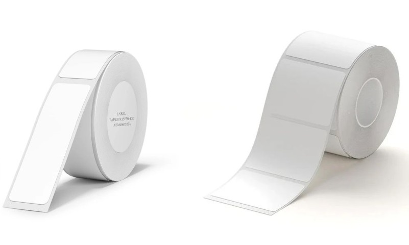
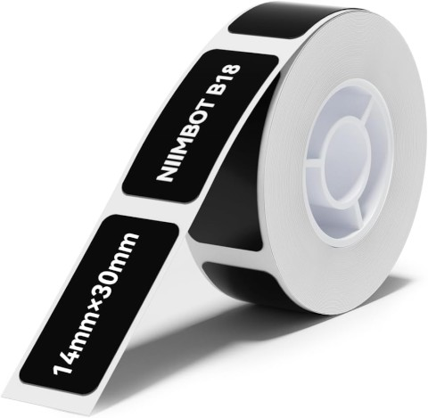
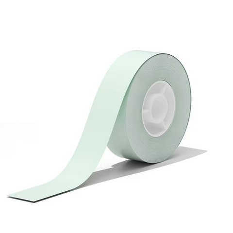
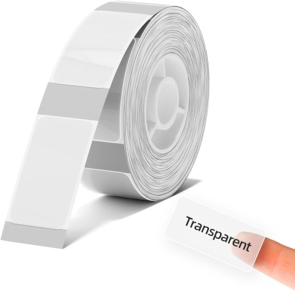

# Label types

| ID  | Name                          |
| --- | ----------------------------- |
| 1   | [With gaps](#1-with-gaps)     |
| 2   | [Black](#2-black)             |
| 3   | [Continuous](#3-continuous)   |
| 4   | Perforated                    |
| 5   | [Transparent](#5-transparent) |
| 6   | PVC tag                       |
| 10  | Black mark gap                |
| 11  | Heat-shrink tube              |

Each label roll contain a RFID tag.
The tags are used to identify the label type and the remaining print count.

Label dimensions are stored in the tag, but printer do not send it to the app.
It used for internal printer logic only (gap calibration on power on or lid close).

App fetches label dimensions from the server by label (barcode/serial) number.

## 1 - With gaps

NIIMBOT uses thermal synthetic labels. They are waterproof.

## 2 - Black

not sure

## 3 - Continuous

## 5 - Transparent

