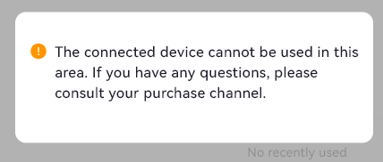

# Region lock

Printers may be region-locked. This is not a hardware restriction.
Official app checks for region lock by sending the printer's serial number to the NIIMBOT server.

## What can I do?

`service@niimbot.com` answer:

> Dear customer,
> We apologize for any inconvenience this may have caused. This issue relates to one of your orders, which we are not authorized to access.
> Please contact the merchant for assistance. If you have any other queries, please do not hesitate to get in touch with us.

So you need to contact seller to add your device to the whitelist and remove region lock.

The region lock has no effect on printing via third-party applications like [niim.blue](https://niim.blue).
